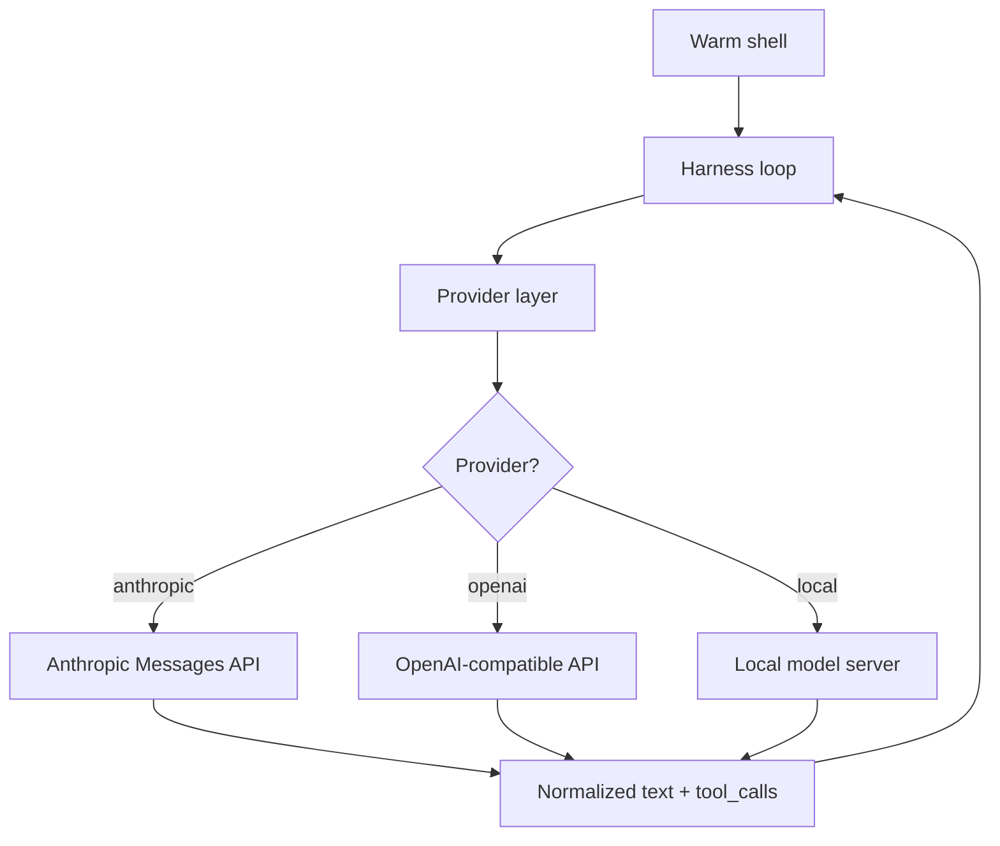
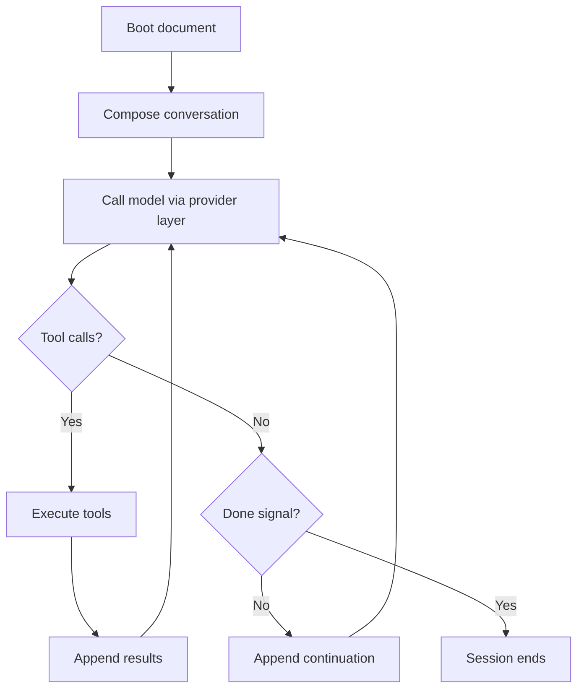
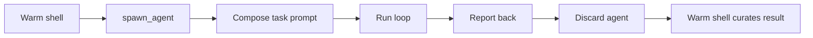
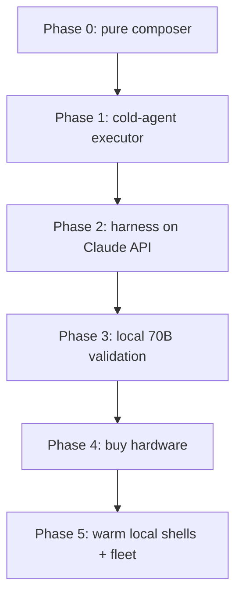

Status: Draft — living specification.

This document specifies the **harness** — a model-agnostic runtime that runs
substrate shells outside Claude Code. It extends, and does not replace, the
substrate described in `README.md`. The current Claude-Code boot path stays in
place until Phase 2 lands.

---

# Overview #

## Purpose ##

Today a shell boots when `make launch` renders a flat `CLAUDE.md` from live DB
state and hands it to the Claude Code CLI. That works, but it couples the
substrate to one harness and one model family. `CLAUDE.md` has significance
only because Claude Code auto-loads it — the convention is harness-specific,
not model-specific.

The harness is a replacement for that runtime. It runs an agent — a *shell* —
as an explicit loop: compose context, call a model, execute tool calls, repeat.
The model behind it can be local or foundational. The substrate (identity,
memory, render) is unchanged; only the thing that *runs* a shell changes.

Three goals drive this:

### Model agnosticism

A shell should run on Claude, on GPT, or on a local model, selected per shell.

### Local inference

Serious local hardware will host large local models. Warm shells with the full
memory system need 70B-class models or larger; smaller models serve bounded
tasks.

### A fleet of differentiated agents

Many shells, each with its own system prompt, its own tooling, and its own
model — some persistent, some ephemeral.

## Scope ##

In scope: the harness runtime, the data-model extensions it requires, the build
sequence, isolation and deployment, and the OS support matrix.

Out of scope: the substrate's existing identity, memory, and render design —
documented in `README.md` — except where the harness extends it. Windows is
explicitly unsupported.

## Terminology ##

| Term | Meaning |
|---|---|
| Substrate | The DB-backed identity / memory / render layer. Exists today. The "what." |
| Harness | The runtime that executes a shell — loop, tools, provider, model. The "run." To be built. |
| Warm shell | A persistent agent with a `shells` row, stable identity, and the full memory system. |
| Cold agent | An ephemeral, memoryless task agent. One task, execute, report, discard. |
| Provider | A model backend — Anthropic, OpenAI, or a local server. |
| Foundational model | A hosted frontier model reached over an API: Claude, GPT, Codex. |
| Local model | A model running on owned hardware via llama.cpp, vLLM, Ollama, or MLX. |
| Boot document | The flat composed context handed to a warm shell at session start. Rendered as `CLAUDE.md` today. |

---

# Architecture #

## Two tiers ##

The system has two kinds of agent. The distinction is **statefulness**, not
model size and not locality.

| Aspect | Warm shell | Cold agent |
|---|---|---|
| Identity | Stable — a `shells` row | None |
| Memory | Full DB memory system | None — stateless |
| Lifetime | Persistent across sessions | A single task |
| Model | Local 70B+ or a foundational model | A small model, chosen per task |
| DB writes | Yes — the memory protocol | No |
| Spawned by | The launcher / operator | A warm shell |
| Purpose | Judgment, continuity, ownership | Bounded execution |

A cold agent is given a task, a model, and a tool set; it runs, reports back,
and is discarded. It cannot write memory because it has no DB write path — which
means a cold agent structurally cannot touch identity. Only a warm shell
curates what its workers surface.

> [!NOTE] Orthogonal axes
> Warm/cold is independent of local/foundational. A warm shell may run on a
> local 70B *or* on Claude. Cold agents draw from a pool of small models.
> "Warm" means stateful, not "local"; "cold" means stateless, not "small."

## Substrate and harness ##

The substrate is the "what" — it already exists and is canonical:

- `shells`, `shell_identity_entries`, `shell_decisions` — identity.
- `shell_memory_archives` — per-session narrative.
- `skills`, `shell_skills` — procedures.
- `projects`, `project_shells`, `flags` — tracking.
- `shell_core/scripts/run.py` — composes the boot document.

The harness is the "run" — it is new:

- Boot composition as a reusable function.
- The agent loop.
- The provider layer.
- The tool registry and executor.

The harness *runs a row*. It does not contain shells; it loads one from the DB
and executes it.

## Request flow ##

Every model call, regardless of shell or provider, takes the same path:



The loop never knows which provider answered. That is the property the harness
must protect.

---

# Data model #

The harness adds four things to the schema. All are extensions; no existing
table changes shape beyond two added columns.

## models ##

A provider-agnostic registry of every model the system can use — local and
foundational alike.

| Column | Type | Notes |
|---|---|---|
| `model_id` | INTEGER PK | |
| `name` | TEXT UNIQUE | e.g. `claude-opus-4`, `llama-3.3-70b`, `qwen2.5-coder-7b` |
| `provider` | TEXT | `anthropic` / `openai` / `local` |
| `endpoint` | TEXT | API base URL, or the local server URL |
| `auth_ref` | TEXT | Name of the env var or secret holding credentials — never the secret itself |
| `tool_dialect` | TEXT | `anthropic` / `openai` / `parsed` — the tool-call format the provider layer must speak |
| `context_window` | INTEGER | Tokens |
| `capability_tags` | TEXT | Comma-separated, e.g. `reasoning,code,vision` |
| `locality` | TEXT | `remote` / `local` |
| `vram_estimate_gb` | INTEGER | Local models only; null otherwise |
| `cost_input` | REAL | Per-1M input tokens; null for local |
| `cost_output` | REAL | Per-1M output tokens; null for local |
| `status` | TEXT | `active` / `inactive` |
| `last_verified` | TEXT | Date |

The `cost` and `locality` columns are carried even before any routing policy
uses them — so routing becomes a later *feature*, not a later *migration*.

## tools and shell_tools ##

Tooling becomes data, mirroring the existing `skills` / `shell_skills` pattern.

#### tools — the registry

| Column | Type | Notes |
|---|---|---|
| `tool_id` | INTEGER PK | |
| `name` | TEXT UNIQUE | e.g. `bash`, `read`, `write`, `edit`, `spawn_agent` |
| `description` | TEXT | Shown to the model |
| `kind` | TEXT | `builtin` / `script` / `mcp` |
| `spec` | TEXT | JSON schema of the tool's parameters |
| `handler` | TEXT | Reference to the implementation |
| `status` | TEXT | `active` / `inactive` |

#### shell_tools — per-shell grants

| Column | Type | Notes |
|---|---|---|
| `shell_id` | INTEGER | FK → `shells` |
| `tool_id` | INTEGER | FK → `tools` |

Primary key is `(shell_id, tool_id)`. A shell's tool set is the join. "Different
tooling per shell" falls out for free.

## skills: the cold-portable flag ##

Skills split into two kinds. Some assume a shell context — identity and memory.
Some are pure procedure.

| Skill kind | Examples | Usable by a cold agent? |
|---|---|---|
| Shell skill | `decision`, `surface_flags`, `laws_management` | No — assumes a `shells` row |
| Task skill | `git-workflow`, `db_patch`, `redline_review` | Yes — pure procedure |

The harness adds one column:

```sql
ALTER TABLE skills ADD COLUMN cold_portable INTEGER NOT NULL DEFAULT 0;
```

Default `0` is the safe default — existing skills are treated as shell-only
until reviewed. A cold agent may only be granted skills where
`cold_portable = 1`. Handing a cold agent a skill that writes to
`shell_decisions` would simply fail.

## Binding a shell to a model ##

```sql
ALTER TABLE shells ADD COLUMN model_id INTEGER REFERENCES models(model_id);
```

A warm shell binds exactly one model. Model fallback — failing over to another
model — is an open question, not part of this revision.

## Cold agents are not stored ##

A cold agent has no row anywhere. It is a runtime construct — a tuple of
`(task_brief, model_id, [tool_id], [skill_id])` — executed and discarded.

An optional `cold_agent_runs` log table may record what was spawned, by which
shell, and a result summary, for observability. It logs *runs*, never *state*.
Whether to keep it is an open question.

---

# The harness #

## Boot composition ##

The composition logic in `run.py` is extracted into a pure function:

```
compose_boot_document(db, shell_id, user) -> str
```

It takes DB state, returns the flat boot document as a string. No file I/O, no
process exec. The current `CLAUDE.md` render calls it and writes the result to
disk as before — behavior unchanged.

A new `run.py --emit` mode prints the boot document to stdout instead of
launching Claude Code. That is the seam: any harness can capture the document
and inject it as a system prompt. `CLAUDE.md` becomes one delivery adapter, not
the mechanism.

> [!TIP] This is the first step and it is free
> Phase 0 is a pure refactor with no behavior change. It de-risks everything
> downstream and can land before any other decision is made.

## The agent loop ##

The loop is small — on the order of 200 lines. It is not the hard part.



Memory writes happen *inside* the loop, as the shell uses its SQL/Bash tools —
exactly as a shell writes memory today. The loop does not special-case memory.

## The provider layer ##

This is the load-bearing component. Warm shells on Claude, GPT, and local
models mean the harness speaks Anthropic Messages, OpenAI chat-completions, and
local-server protocols — each with a *different* tool-calling format.

The provider layer's single contract:

> Take a conversation and a set of tool definitions. Call any provider. Return
> a normalized `{ text, tool_calls }` to the loop — identical in shape
> regardless of provider.

If tool calls do not look identical to the loop, skills and tools become
provider-specific and model agnosticism collapses. The `models.tool_dialect`
column tells the provider layer which format to encode and parse.

### Tool dialects

| Dialect | Used by | Mechanism |
|---|---|---|
| `anthropic` | Claude | Native tool use |
| `openai` | GPT, most local servers | OpenAI-style function calling |
| `parsed` | Local models without function calling | Prompted protocol, parsed from text |

The `parsed` dialect is the riskiest and is validated in Phase 3.

## Tool registry and execution ##

Tools are loaded from the `tools` table and filtered by the shell's
`shell_tools` grants. The executor maps a normalized tool call to a handler,
runs it, and returns the result to the loop.

The initial tool set is deliberately small — the use is specific, so the
surface is small: `bash`, `read`, `write`, `edit`, and `spawn_agent`. A general
agent ships twenty tools; this one needs five.

---

# Cold agents #

## The spawn tool ##

A warm shell spawns a cold agent by calling the `spawn_agent` tool. The tool's
parameters force a self-contained brief:

| Field | Type | Required | Notes |
|---|---|---|---|
| `task` | string | yes | The complete, self-contained brief — see the briefing contract |
| `model` | string | no | A `models.name`; defaults to a configured small model |
| `tools` | list | no | Tool names to grant; defaults to a minimal read-only set |
| `skills` | list | no | Must be `cold_portable = 1` skills |

## Lifecycle ##



The cold agent's report is the tool result returned to the warm shell. The
warm shell decides what, if anything, enters memory. Curation stays the warm
shell's prerogative.

## The briefing contract ##

A cold agent's output quality is bounded by the brief, not only by the model.
A weak model briefed well beats a strong model briefed badly.

### A brief must be self-contained

The cold agent has no memory and no identity. It does not know the project, the
history, or what was tried. The brief carries everything: the goal, the
relevant context, what to return, and any constraints.

### A brief states the return shape

"Report a punch list," "return the file path and line numbers," "answer in
under 200 words." The warm shell must say what *form* the answer takes.

---

# Build sequence #

Six phases. Each changes one variable. Hardware is bought last, and the first
phase needs nothing but the existing repo.



## Phase 0 — pure composer ##

Extract `compose_boot_document()` from `run.py`. Add `run.py --emit`.

#### Deliverable

A pure composition function and an emit mode.

#### Exit criteria

The `CLAUDE.md` render is byte-identical to before; `--emit` prints the same
document to stdout.

## Phase 1 — cold-agent executor ##

Build the minimal loop: task brief, tools, model, provider call, tool
execution, return value. No memory, no boot composition. Expose it as a
`spawn_agent` tool that is callable *from within Claude Code today*.

Start with the riskiest spike: one candidate local model, one tool (`bash`),
and confirm the model can reliably make and *chain* tool calls. That single
experiment tells you whether this is a weekend or a slog.

#### Deliverable

A cold-agent executor and a `spawn_agent` tool.

#### Exit criteria

CC, running in Claude Code, spawns a local cold agent that completes a bounded
task and reports back.

## Phase 2 — harness on Claude API ##

Build the warm-shell runtime: boot composition, the agent loop, the provider
layer, the tool registry. Run a warm shell backed by **Claude via API** — the
model already trusted today.

This isolates one variable: it proves the *harness* is correct without
introducing an unproven local model.

#### Deliverable

A warm-shell harness running outside Claude Code.

#### Exit criteria

A warm shell boots, runs a full session, and writes memory correctly per the
protocol — end to end, on Claude, with no Claude Code.

## Phase 3 — local 70B validation ##

Rent a cloud GPU. Point a warm shell at a local 70B-class model. Run real
sessions exercising the real memory protocol.

#### Deliverable

A tested answer to: can a local model carry the memory protocol?

#### Exit criteria

The memory protocol holds on a local model — or it is known which models hold
it and which do not.

> [!WARNING] Do not buy hardware to answer Phase 3
> "70B+ will be fine" is an assumption, not a fact. The memory protocol is
> complex. Validate it on a rented GPU for a few dollars an hour *before*
> specifying a machine.

## Phase 4 — buy hardware ##

Specify and purchase the machine, informed by Phases 1–3: model sizes, whether
warm and cold run concurrently, and whether cold agents are latency- or
throughput-bound.

#### Exit criteria

Hardware on hand, sized to evidence rather than guesswork.

## Phase 5 — warm local shells and the fleet ##

Containerize. Bring up the bare-metal fleet: warm local shells plus cold agents,
each in a container with scoped GPU access. Migrate.

#### Exit criteria

The fleet runs on bare metal; warm shells run on local models; cold agents are
spawned and discarded under load.

---

# Isolation and deployment #

## Two reasons for containment ##

Containment is needed for two *different* reasons, and conflating them leads to
the wrong design.

### Trust — the remote brain

An agent backed by a remote model holds shell access while its "brain" runs on
third-party infrastructure. The risk is upstream: a compromised service, a
provider seeing local data. This risk is specific to remote-backed agents.

### Capability — the autonomous tool user

Any agent with tools — `bash`, network, `git push` — is a blast-radius risk
regardless of where its model runs. A fleet running less attended than a single
interactive session is, if anything, a larger capability risk.

## CC stays in the VM ##

CC runs in a VM today because of the *trust* reason — it is backed by a remote
model. That rationale does not transfer to local shells, whose brains run on
owned hardware. CC therefore does not move: the new system is a different kind
of risk, not the same one.

The harness is developed on the bare-metal host and run there; CC contributes
from the VM via the repo and the `shared/` folder. The build loop is
write-in-VM, run-on-host — slower than running in place, and worth accepting
deliberately.

## The fleet: Docker and the NVIDIA Container Toolkit ##

The local fleet still needs containment — for the *capability* reason. The
mechanism is Docker, with GPU access via the NVIDIA Container Toolkit.

The toolkit is not GPU passthrough. Containers share the host kernel; the
toolkit injects the host's GPU device nodes and driver libraries into the
container at startup. Consequences:

- The host keeps the GPU; multiple containers share it.
- No BIOS, IOMMU, or kernel-parameter work — none of the VM-passthrough hassle.
- The NVIDIA driver is installed once, on the host. Container images carry the
  CUDA runtime libraries but not the driver.

A warm 70B shell can hold one GPU while cold-agent containers share another,
scoped per container with `--gpus`.

> [!WARNING] A GPU container is not a VM-grade boundary
> Containers share the host kernel, and GPU access widens that shared surface.
> Docker here gives blast-radius containment and reproducibility — not the
> airtight isolation a VM provides. This is acceptable precisely because the
> fleet's risk is capability, not trust.

> [!NOTE] GPU memory is not partitioned by default
> Two containers on one card share its VRAM; one can starve the other.
> Hard partitioning requires MIG, available only on datacenter-class GPUs.
> Plan VRAM budget explicitly, or give warm and cold separate cards.

## Migration to bare metal ##

Once the fleet runs safely, the system migrates fully to bare metal. The
NVIDIA Container Toolkit is the enabling piece: it lets the whole fleet — and
eventually CC itself — run as containers on the metal with real GPU access,
with no passthrough anywhere in the design.

An earlier substrate's "host-level, no docker" rule was a scoped decision for
that *existing* substrate. It does not bind the harness, which is free to use
containers.

---

# OS support #

## Support matrix ##

| Target | Package source | GPU stack | Containers | Status |
|---|---|---|---|---|
| Ubuntu | apt | NVIDIA / CUDA | Docker + NVIDIA Container Toolkit | Planned |
| Arch (CachyOS first) | pacman / AUR | NVIDIA / CUDA | Docker + NVIDIA Container Toolkit | Planned — primary bare-metal target |
| macOS (Apple Silicon) | brew | Metal / MLX | Native only — see below | Planned |
| Windows | — | — | — | Not supported |

## Linux ##

Ubuntu and Arch differ almost entirely in *prerequisite installation* —
`apt` versus `pacman` / AUR, and package names. The substrate is Python, Node,
and SQLite; the launcher resolves paths from `__file__`. None of that is
distro-specific.

The per-OS work is a thin bootstrap script that installs prerequisites. It
carries no architectural weight. `make install` stays OS-agnostic — it only
builds the venv and installs Python and Node dependencies.

CachyOS is treated as "Arch plus pacman and AUR." Its tuned kernel is
irrelevant to containers, which use the host kernel regardless.

### Arch rolling-release wrinkle

On a rolling release, a brand-new kernel can briefly outrun the NVIDIA kernel
module. An operational detail, not a design one — pin or wait when it happens.

## macOS ##

Mac is the real divergence, and it changes one earlier assumption.

> [!WARNING] The container-GPU strategy is Linux-only
> Apple Silicon has no NVIDIA, no CUDA, and no NVIDIA Container Toolkit — GPUs
> are Metal. Docker Desktop on Mac runs a Linux VM that cannot see the Metal
> GPU. On Mac, GPU-accelerated inference must run **natively on the host**, via
> MLX or a Metal backend — never in a container.

This is absorbed by the provider layer. A warm shell binds a `model_id`; the
registry holds the endpoint. Whether that endpoint is a CUDA container running
vLLM on CachyOS or a native MLX server on a Mac, the harness never knows. The
OS and GPU divergence collapses into "how the model server is stood up" —
bootstrap and ops, not harness logic.

The design rule that follows: **never bake `docker` or `CUDA` assumptions into
the harness core.**

Apple Silicon's unified memory is a genuine strength for warm shells — a
large-memory Mac can hold a 70B model without the VRAM-budget work a discrete
GPU forces. A CachyOS + NVIDIA box and a big-memory Mac are two legitimate
warm-shell hosts that reach the GPU by different roads.

---

# Open questions #

| Question | Why it matters |
|---|---|
| Do warm and cold agents run concurrently? | Determines VRAM budget and therefore the hardware spec (Phase 4). |
| Is Mac a warm-shell host, or a client/dev box? | Sizes how much the Mac flavor must do — control plane only, or full MLX inference host. |
| How many distinct tool dialects are needed? | Each `parsed`-dialect model may need its own parser; affects provider-layer cost. |
| Context strategy for small windows? | Local windows are far smaller than Claude's; truncation, summarization, or RAG over the DB. |
| Model fallback? | Whether a warm shell can fail over to another model if its bound model is unavailable. |
| Keep `cold_agent_runs`? | Observability value versus schema and write overhead. |

---

# Risks #

## Tool-calling reliability ##

The agent loop's reliability is bounded by the model's tool-calling reliability.
Local models range from solid OpenAI-style function calling to needing a
prompted, hand-parsed protocol. This is the make-or-break risk.

Mitigation: the Phase 1 spike tests exactly this, first, before anything else
is built.

## Instruction-following on local models ##

> [!WARNING] The memory protocol assumes a strong instruction-follower
> Curate-don't-accumulate, write-as-you-go, never-edit-prior-rows — all of it
> assumes a model that follows complex instructions reliably. A small local
> model will not. Move enforcement from prompt instructions into *code*: the
> existing cap triggers are the model for this. Do not trust the model to write
> memory correctly — make correct the only easy path.

## Maintenance tax ##

Owning the harness means owning what Claude Code provides for free — context
management, model support, tool ergonomics, provider plumbing. This is a
permanent cost. It is accepted deliberately, in exchange for model agnosticism
and a local fleet.

## Containment is blast-radius, not airtight ##

The fleet's Docker isolation contains blast radius; it is not a trust boundary.
This is acceptable only because the fleet's models run locally and the risk is
capability, not trust. If that ever changes, the isolation model must be
revisited.
