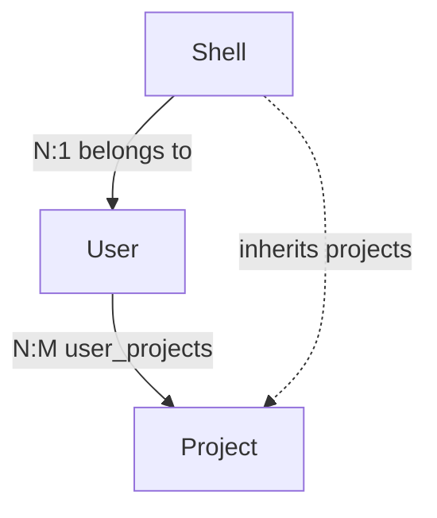
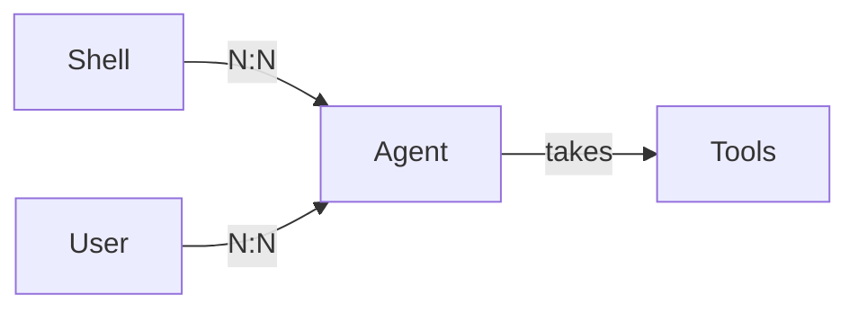
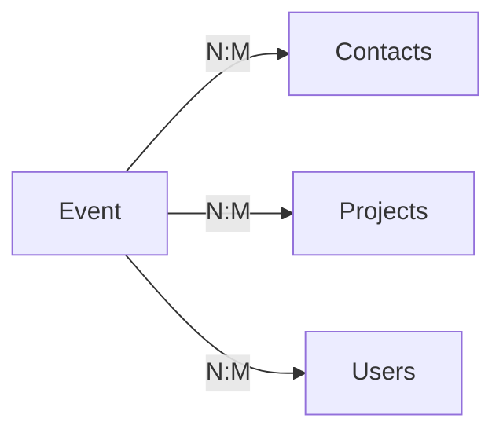
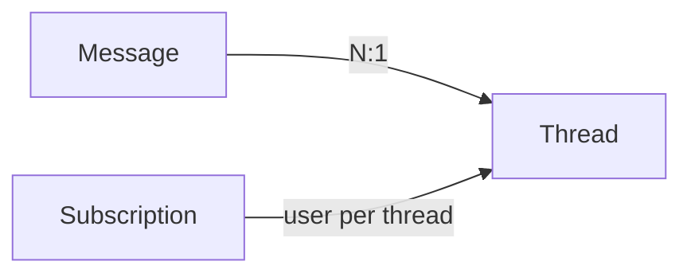

# Core Data Model

## Overview

This spec defines the core relational model for dos-arch: how shells, users, and projects relate, and the new surfaces that hang off projects — **contacts**, **emails**, **calendar events**, and a unified **notes** feed. Messaging (threads, subscriptions) is named as future scope, not built here.

The through-line: **the project is the spine.** Access flows user → project; correspondence and events file under a contact's default project; everything that isn't a project or a user ultimately points at one.

> [!class1]
> Two tables are primary: **projects** and **users**. A shell belongs to a user; a user's projects are the shell's. There is no team layer and no shell-side scoping — both were removed as dead weight.

```stats
:::class1
value: 1
label: Access join table
description: user_projects replaces a four-table mesh
:::class4
value: 4
label: Tables dropped
description: shell_groups, members, project_groups, project_shells
:::class3
value: 4
label: New surfaces
description: contacts, emails, events, notes (agents + messaging future)
```

## Decisions

These are settled and supersede the prior CC-090 ownership model.

> [!class4]
> **Abandon shell groups.** `shell_groups`, `shell_group_members`, and `project_groups` are removed. The shell-level "hard boundary" added complexity to answer a question we don't need to ask. Visibility is derived, not stored.

> [!class3]
> **Shell ownership is user-scoped.** A shell belongs to exactly one **user** (`shells.user_id`), never to a project. A shell is not co-owned and is not bound to a project directly.

> [!class3]
> **Project membership is user-scoped, many-to-many.** Users and projects relate through one join table, `user_projects`. A shell inherits its projects from its user: if the user is on a project, so is the shell. No `project_shells`, no per-shell scoping.

> [!class4]
> **Teams are abandoned.** The project *is* the organizational unit — it already carries membership, a shared dir, and work. A separate team entity was redundant. The entire team layer (`teams`, `team_fnb`, `team_projects`, `team_agents`) is never built.

> [!class3]
> **Agents are a distinct, future entity.** Agents are not shells — instructions + tooling, no identity. They belong to a **shell or a user (N:N to both)** and **take tools**. The only call settled now: agents do **not** anchor to projects or teams. The subsystem is sketched under Agents, built in a later pass.

> [!class3]
> **Project membership is self-service.** Every user can see every project in the UI and joins or leaves on their own — no admin add/remove. The project creator is an owner; a project may have multiple owners; everyone else joins as `member`.

| Decision | Replaces | Effect |
|---|---|---|
| Shell → user ownership | shell bound to project | `shells.user_id` canonical; no `project_id` column |
| `user_projects` N:M | shell_groups mesh | one join table; shell inherits from user |
| Drop shell groups | CC-090 scoping layer | 4 tables removed |
| Drop teams | CC-090 team layer | team tables never built |
| Agents not project-anchored | CC-090 agents-on-teams | agent ↔ shell-or-user (N:N), take tools; future build |
| Self-join membership | admin add/remove | all projects visible; users join/leave themselves |

This spec **supersedes CC-090** in full — including the agent-pool anchor, now resolved: agents are not project/team-bound (they attach to shells or users), with the full subsystem deferred to future scope.

## Schema

Every table this spec touches, by status. **Build now** is the migration scope; **future** is sketched only.

| Table | Status | Purpose |
|---|---|---|
| `user_projects` | build now | user ↔ project membership (N:M); role owner/member |
| `contacts` | build now | external people + geocoded location |
| `contact_projects` | build now | contact ↔ project (N:M) |
| `emails` | build now | correspondence, N:1 contact, editable project |
| `events` | build now | calendar events + location |
| `event_contacts` | build now | event ↔ contact (N:M) |
| `event_users` | build now | event ↔ user (N:M) |
| `event_projects` | build now | event ↔ project (N:M), `is_primary` default |
| `notes` | build now | unified annotation feed (exclusive arc) |
| `shells` | modify | `user_id` is owner; no `project_id` |
| `project_shells` | drop | replaced by `user_projects` inheritance |
| `shell_groups` | drop | scoping layer abandoned |
| `shell_group_members` | drop | — |
| `project_groups` | drop | — |
| `agents`, `shell_agents`, `user_agents`, `agent_tools` | future | agent subsystem (see Agents) |
| `automated_prompts` | future | triggered send/resend for agentic flows |
| `threads`, `messages`, `thread_subscriptions` | future | messaging (separate spec) |

## Access Model



The dotted edge is **derived, never stored** — a shell's project access is computed from its user's `user_projects` rows.

```sql
-- shells.user_id is the canonical owner (column already exists)
-- no shells.project_id

CREATE TABLE user_projects (
  user_project_id INTEGER PRIMARY KEY AUTOINCREMENT,
  user_id    INTEGER NOT NULL REFERENCES users(user_id),
  project_id INTEGER NOT NULL REFERENCES projects(project_id),
  role       TEXT NOT NULL DEFAULT 'member'
               CHECK(role IN ('owner','member')),   -- creator=owner; multi-owner allowed
  added_at   TIMESTAMP NOT NULL DEFAULT CURRENT_TIMESTAMP,
  is_deleted INTEGER NOT NULL DEFAULT 0,
  UNIQUE (user_id, project_id)
);
```

> [!class2]
> **Visibility ≠ membership.** All projects are visible to all users in the UI for discovery; `user_projects` records who has *joined*. A shell inherits only its user's **joined** projects — not the full catalogue. Join/leave is self-service; the creator lands as `owner`, others as `member`.

### Effective shell visibility

```linear
Shell :::class2 -> its User :::class1 -> user_projects :::class1 -> Projects :::class3
```

A shell at boot carries its user and, through `user_projects`, the set of projects it may act in. The UI's active-project selector picks one of these for the session.

## Agents

**Future scope — sketched, not built in this pass.** Captured so the access model leaves room for it.

Agents are **not** shells: instructions + tooling, no persistent identity or memory. The one thing settled now is anchoring — an agent belongs to a **shell or a user, many-to-many to both** (not to projects or teams). An agent **takes tools** (the same tool model shells already use). Both a shell and a user can launch one.

Agentic "workflows" run on an **`automated_prompts`** table: prompts with triggers that send and re-send as conditions are met — the engine behind worker/checker loops.

```sql
-- FUTURE — agent subsystem (separate build)
-- agents(agent_id, name, description, ...)
-- shell_agents(shell_id, agent_id)         -- agent ↔ shell  (N:N)
-- user_agents(user_id, agent_id)           -- agent ↔ user   (N:N)
-- agent_tools(agent_id, tool_id)           -- agents take tools
-- automated_prompts(prompt_id, agent_id, trigger, body, ...)  -- send/resend
```



> [!class4]
> **Agentic flows.** Loops that run until a condition is met, minimum two agents: one **working**, one **checking** that approves or restarts the loop. The `automated_prompts` triggers drive the re-sends. Full orchestration is its own spec. *(Note: shells already have a `shell_prompt_automations` table — the agent version is a parallel, not a reuse.)*

## Contacts

External people with structured metadata. **N:M to projects**, plus an editable `default_project_id` — the project most of this contact's correspondence files under.

```sql
CREATE TABLE contacts (
  contact_id INTEGER PRIMARY KEY AUTOINCREMENT,
  name       TEXT NOT NULL,
  email      TEXT,
  phone      TEXT,
  -- structured / geocoded location (not raw text):
  formatted_address TEXT,
  locality   TEXT,
  region     TEXT,
  country    TEXT,
  postal_code TEXT,
  lat        REAL,
  lng        REAL,
  default_project_id INTEGER REFERENCES projects(project_id),
  is_deleted INTEGER NOT NULL DEFAULT 0,
  created_at TIMESTAMP NOT NULL DEFAULT CURRENT_TIMESTAMP
);

CREATE TABLE contact_projects (
  contact_project_id INTEGER PRIMARY KEY AUTOINCREMENT,
  contact_id INTEGER NOT NULL REFERENCES contacts(contact_id),
  project_id INTEGER NOT NULL REFERENCES projects(project_id),
  is_deleted INTEGER NOT NULL DEFAULT 0,
  UNIQUE (contact_id, project_id)
);
```

> [!class2]
> **Location is geocoded, not freeform.** `lat`/`lng` make it a real, mappable location; the component columns support filtering. Source data is **normalized through a third-party location/geocoding service** (tool TBD) rather than entered raw. Inlined per-entity for now — a shared `locations` table only pays off if venues start repeating.

> [!class4]
> **Soft rule:** `default_project_id` must be one of the contact's `contact_projects`. A contact cannot default to a project it isn't a member of.

## Emails

Correspondence records tied to a contact. The defining behavior: `project_id` is **seeded from the contact's default at creation, then overridable per email** — most of a contact's mail is about their default project, but any single message can be re-filed.

```sql
CREATE TABLE emails (
  email_id   INTEGER PRIMARY KEY AUTOINCREMENT,
  contact_id INTEGER NOT NULL REFERENCES contacts(contact_id),
  project_id INTEGER REFERENCES projects(project_id),  -- seeded from contact default, editable
  direction  TEXT CHECK(direction IN ('inbound','outbound')),
  subject    TEXT,
  body       TEXT,
  occurred_at TIMESTAMP,                 -- sent / received time
  message_id TEXT,                       -- optional: real mail-sync later
  thread_id  TEXT,
  is_deleted INTEGER NOT NULL DEFAULT 0,
  created_at TIMESTAMP NOT NULL DEFAULT CURRENT_TIMESTAMP
);
```

> [!class4]
> Modeled **N:1 contact** per scope. If multi-recipient (cc) is ever needed, this grows an `email_contacts` join — noted, not built.

## Calendar / Events

One event relates to **multiple contacts, multiple projects, and multiple users**. The editable "default project" is expressed as the `is_primary` row of the project join — one source for "which project," no separate FK column.

```sql
CREATE TABLE events (
  event_id   INTEGER PRIMARY KEY AUTOINCREMENT,
  title      TEXT NOT NULL,
  start_at   TIMESTAMP,
  end_at     TIMESTAMP,
  formatted_address TEXT, locality TEXT, region TEXT,
  country TEXT, postal_code TEXT, lat REAL, lng REAL,
  is_deleted INTEGER NOT NULL DEFAULT 0,
  created_at TIMESTAMP NOT NULL DEFAULT CURRENT_TIMESTAMP
);

CREATE TABLE event_contacts (
  event_id   INTEGER NOT NULL REFERENCES events(event_id),
  contact_id INTEGER NOT NULL REFERENCES contacts(contact_id),
  UNIQUE (event_id, contact_id)
);

CREATE TABLE event_users (
  event_id INTEGER NOT NULL REFERENCES events(event_id),
  user_id  INTEGER NOT NULL REFERENCES users(user_id),
  UNIQUE (event_id, user_id)
);

CREATE TABLE event_projects (
  event_id   INTEGER NOT NULL REFERENCES events(event_id),
  project_id INTEGER NOT NULL REFERENCES projects(project_id),
  is_primary INTEGER NOT NULL DEFAULT 0,   -- the editable "default" project
  UNIQUE (event_id, project_id)
);
```



## Notes

A **feed** — many timestamped, authored entries — modeled as one unified table with an **exclusive arc** (typed nullable FKs, a CHECK enforcing the valid target per kind). Chosen over a polymorphic `(entity_type, entity_id)` table because the arc keeps full FK integrity and cascade; chosen over per-type tables because four targets across multiple kinds would explode combinatorially.

### Kind → target matrix

| kind | contact | event | project | user |
|---|:---:|:---:|:---:|:---:|
| `note` | ✓ | ✓ | ✓ | ✓ |
| `document` | — | ✓ | ✓ | — |
| `meeting_prep` | — | ✓ | — | — |
| `meeting_result` | — | ✓ | — | — |

```sql
CREATE TABLE notes (
  note_id INTEGER PRIMARY KEY AUTOINCREMENT,
  kind    TEXT NOT NULL CHECK(kind IN
            ('note','document','meeting_prep','meeting_result')),
  body    TEXT,
  author_user_id INTEGER REFERENCES users(user_id),
  -- target arc (kind-constrained per matrix):
  contact_id INTEGER REFERENCES contacts(contact_id),
  event_id   INTEGER REFERENCES events(event_id),
  project_id INTEGER REFERENCES projects(project_id),
  user_id    INTEGER REFERENCES users(user_id),
  -- document kind only:
  doc_url  TEXT, doc_mime TEXT, doc_size INTEGER,
  is_deleted INTEGER NOT NULL DEFAULT 0,
  created_at TIMESTAMP NOT NULL DEFAULT CURRENT_TIMESTAMP,
  CHECK (
       (kind='note' AND
          (contact_id IS NOT NULL) + (event_id IS NOT NULL)
        + (project_id IS NOT NULL) + (user_id IS NOT NULL) = 1)
    OR (kind='document' AND user_id IS NULL AND contact_id IS NULL AND
          (event_id IS NOT NULL) + (project_id IS NOT NULL) = 1)
    OR (kind IN ('meeting_prep','meeting_result') AND event_id IS NOT NULL
          AND contact_id IS NULL AND project_id IS NULL AND user_id IS NULL)
  )
);
```

> [!class3]
> **`message` was deliberately excluded.** It has its own lifecycle — delivery, threads, read state, subscription — that would pollute an otherwise write-once annotation table. It lives in the future-scope messaging subsystem instead. The remaining kinds have no independent lifecycle, so this table is stable.

## Migration Plan

```linear
Build new :::class1 -> Backfill :::class2 -> Drop mesh :::class4 -> Verify :::class3
```

1. **Build new tables** — `user_projects`, `contacts`, `contact_projects`, `emails`, `events`, `event_contacts`, `event_users`, `event_projects`, `notes`.
2. **Backfill `user_projects`** — derive from any existing project↔shell intent (currently 0 rows live, so effectively a clean start).
3. **Drop the mesh** — `project_shells`, `shell_groups`, `shell_group_members`, `project_groups`. Audit consumers first (API routers, render chain, UI) before the drop — contract audit, not just code strip.
4. **Verify** — confirm shell-visibility derivation works end to end against `user_projects`; restart API/UI; smoke-test the active-project selector.

> [!class4]
> All mesh tables are empty in the live DB, so the drop is low-risk on data — but consumer code may still reference them. Ground-truth a grep of the API/UI/render chain before dropping.

## Future Scope

Not built in this spec. Messaging is its own subsystem and its own flag, because threads + subscription + read-state is exactly the complexity we are keeping out of `notes`.

```sql
-- FUTURE — messaging subsystem (separate spec)
-- threads(thread_id, subject, project_id?, created_by, created_at)
-- messages(message_id, thread_id FK, sender_user_id, body, created_at)
-- thread_subscriptions(thread_id, user_id, muted, last_read_message_id)
```



> [!class2]
> **Decided:** messaging is a **separate surface**, not merged into the notes timeline — its complexity (threads, subscriptions, read-state) earns its own feature spec. Listed here only so the seam is acknowledged.

## Open Questions

Resolved in this pass:

- [x] **Agent anchor** — not project/team-bound. Agents attach to a shell or a user (N:N) and take tools. Full subsystem is future scope. See Agents.
- [x] **`user_projects.role`** — `owner` | `member`; creator = owner; multiple owners allowed; everyone else `member`.
- [x] **Membership UX** — all projects visible to all users; self-service join/leave; no admin add/remove.
- [x] **Messaging surface** — its own surface and its own feature spec; not merged with the notes timeline.

Still open:

- [ ] **Location service** — select the third-party geocoding/normalization tool feeding contact + event locations.
- [ ] **Agent subsystem design** — ownership tables (`shell_agents` + `user_agents`), `agent_tools`, `automated_prompts` (triggered send/resend), and the worker/checker loop. Future spec.
- [ ] **Shared `locations` table** — defer until venue reuse is observed.
