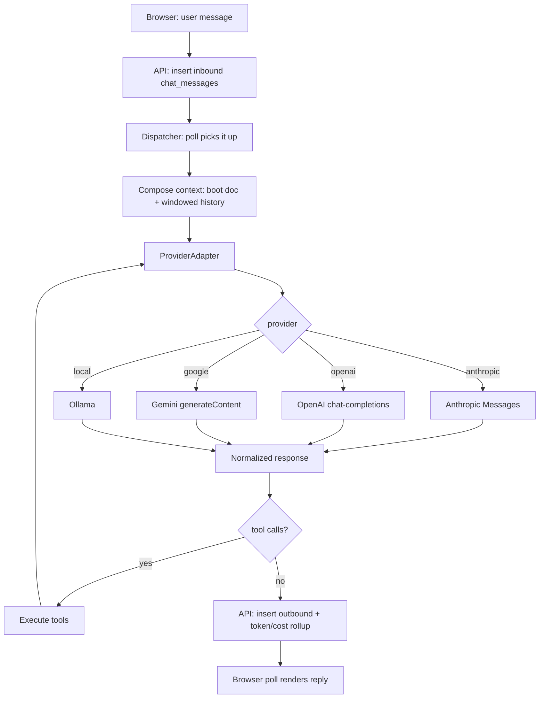
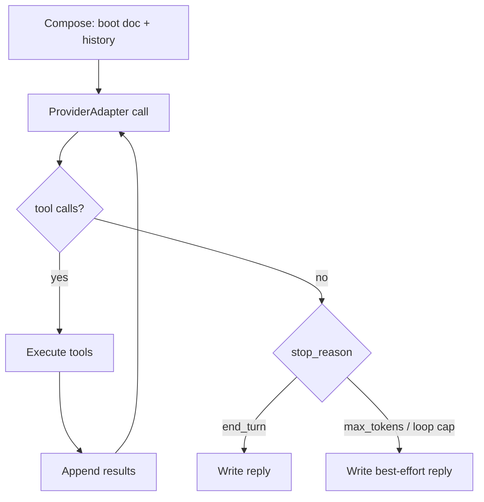

# DOS-Arch — Agnostic Runtime & Browser-Chat Spec

Status: Draft — living specification. 2026-05-18.

Supersedes `docs/archive/harness-spec.md`. That earlier draft sketched the
model-agnostic harness at a lower level of detail and predated two working
implementations (KinLive, ExpLive). This document replaces it: it carries
forward the parts that held up — the `models` registry, the provider layer,
tools-as-data, the shell/agent distinction, the isolation model — and adds
the full browser-chat product design that the earlier draft did not cover.

---

# 1. Purpose and scope #

## Purpose ##

Run substrate shells **agnostically** across model providers — Claude
(Opus/Sonnet/Haiku), Gemini, OpenAI, and local models via Ollama — through a
web chat interface with a model-switch dropdown. DB-sourced state is the
system prompt and context. The model behind a shell is a per-conversation
choice, not an architectural assumption.

The product framing matters and shapes the design: this is **a dev-team app
for amateur "vibe coders" who want to own their stack and switch models
smartly** — not a CMS, not a chatbot. A shell is a coding agent with a real
workspace. Dev capability is a first-class requirement, not an add-on.

The dependency being removed is not Claude — it is the *assumption that there
is only one model*. Claude remains a fully supported choice; it stops being
the only one.

## Scope ##

In scope: the agnostic runtime (dispatcher, provider layer, tool layer), the
browser-chat surface (conversation model, compaction, controls), the data-model
extensions, auth, and the build sequence.

Out of scope, treated as existing and canonical: the substrate's identity,
memory, and render design (see `README.md`). The memory layer's redesign —
capture, summarization, and recall — is its own peer spec,
`docs/specs/memory-recall.md`. The legacy `make launch` →
`CLAUDE.md` → Claude Code CLI boot path coexists during migration; unifying or
retiring it is not specified here.

## Lineage ##

Two prior systems are consolidated by this spec:

| System | Contributes | Verdict |
|---|---|---|
| **ExpLive** (`designs_os`) | The dispatcher: an agent loop calling the Anthropic SDK directly, with DB-owned history, a rolling window, and `api_*` tools. The own-runtime — already working. | **Host.** Generalize it. |
| **KLV** (`Alpha`) | Two-surface auth, atomic shell activation, per-shell containers, security hardening. Its re-enter mechanism delegated context to Claude Code session files. | Auth + container model reused; re-enter mechanism **retired** (replaced by DB-owned replay). |

## Where this sits ##

dos-arch decomposes AI implementation into four primitives — **model**,
**harness**, **agent**, **shell** (see README). This spec defines the
**harness** primitive (the dispatcher, the provider layer, the tool layer)
and the **model** primitive's substrate-level concerns (the `models`
registry, the `ProviderAdapter` seam). The **shell** primitive is referenced
as existing-and-canonical (substrate identity + memory; §1 Scope), and the
**agent** primitive is owned by the peer spec `docs/specs/cold-agents.md` —
this spec uses cold agents (§7.3) but does not define them.

The substrate has no separate workflow primitive; workflow is what emerges
when shells compose agents and other shells.

---

# 2. Terminology #

| Term | Meaning |
|---|---|
| Substrate | The DB-backed identity / memory / render layer. Exists today. |
| Runtime | The **dispatcher** — composes context, calls a model, executes tools, loops. The thing that *runs* a shell. |
| Shell | A persistent agent — a `shells` row, stable instance-managed identity (seed, L&S), the full memory system, a browser chat. Dev-capable. The persistent execution primitive. |
| Cold agent | An ephemeral task worker — no identity, no memory. One task, execute, report, discard. The ephemeral execution primitive (defined in `docs/specs/cold-agents.md`). |
| Provider | A model backend — Anthropic, OpenAI, Google, or a local server. |
| `ProviderAdapter` | The component that makes one provider speak the runtime's normalized contract. The single agnostic seam. |
| Conversation | One chat thread between a user and a shell — a `chat_sessions` row plus its `chat_messages`. |
| Boot document | The composed system-prompt context handed to a shell at session start. |

---

# 3. Architecture #

## 3.1 Three layers ##

| Layer | What it is | Status |
|---|---|---|
| **State** | The DB — identity, memory, skills, conversations, models, tools. Single source of truth. | Exists |
| **Runtime** | The dispatcher — agent loop, provider layer, tool layer. Owns the turn. | ExpLive; to be generalized |
| **Transport** | Own API, two-surface auth, browser UI, model dropdown. | KinLive/ExpLive; to be consolidated |

The layers are decoupled: the State layer is provider-blind, the Transport
layer is provider-blind, and only one component inside the Runtime layer is
provider-aware.

## 3.2 Shells and cold agents ##

The runtime executes against two primitives — **shell** and **agent** (see
§1, Where this sits). The distinction is **statefulness**, not model size and
not locality.

| Aspect | Shell | Cold agent |
|---|---|---|
| Identity | Stable — a `shells` row | None |
| Memory | Full DB memory system | None |
| Lifetime | Persistent across sessions | A single task |
| Interface | Browser chat | None — spawned, reports back |
| DB writes | Yes — the memory protocol | None to identity/memory; narrow functional writes only (see §7.3) |
| Spawned by | The launcher / operator | A shell, the dispatcher, an operator, or the scheduler (see cold-agents.md §6) |

A cold agent structurally cannot touch identity or memory — it has no write
path to those tables. The compaction agent (§7.3) is the first cold agent.

> [!NOTE] One shell architecture, capability-gated
> An earlier draft split "browser shells" from "dev shells" as separate
> architectures. That split is dropped. There is **one** shell architecture;
> every shell is dev-capable. `shells.kind` now gates *tool grants* (which
> tools a shell may use), not which runtime runs it.

## 3.3 The dispatcher is the runtime ##

ExpLive already built the runtime. `dispatch_live.py` is an explicit agent
loop — poll for an inbound message, compose context, call a model, execute
tool calls, loop until the model stops, write the reply. It owns history (DB
rolling window), tool execution (`api_*` tools), and concurrency (thread per
shell, per-session lock). It is not a wrapper around Claude Code — it *is* the
harness. It speaks only Anthropic today; that is the one thing this spec
changes.

There is no embedded CLI harness and no `--resume` to a provider-side session.
The conversation lives in the DB; the runtime replays it. This is what makes
the runtime portable — and it is also more robust: a container restart cannot
lose conversation context, because context was never in the container.

## 3.4 The `ProviderAdapter` seam ##

Walk the dispatcher and the provider dependency concentrates in exactly one
place: the model call and the shaping/parsing around it. Everything else —
polling, locking, history, tools, reply-write, compaction — is provider-blind.

The `ProviderAdapter` interface:

```
format_request(system_blocks, tools, messages, model, max_tokens) -> native request
call(request)                                                     -> native response
parse_response(response)  -> { text, tool_calls[], usage{}, stop_reason }
cost(usage, model)        -> usd
```

The dispatcher thinks in one normalized vocabulary — "3 system blocks, a tool
list, a message list, a tool-use loop until end_turn." Each adapter projects
that onto its provider's wire format. **If a tool call does not look identical
to the loop regardless of provider, model agnosticism collapses.** That is the
property the seam must protect.

## 3.5 Request flow ##



The loop never knows which provider answered.

---

# 4. Data model #

Schema deltas against the current `shell_core/schema.sql`. The browser-chat
tables (`chat_sessions`, `chat_messages`) exist in `designs_os` today and are
brought into the substrate by this spec.

## 4.1 models ##

A provider-agnostic registry of every model the system can use.

| Column | Type | Notes |
|---|---|---|
| `model_id` | INTEGER PK | |
| `name` | TEXT UNIQUE | `claude-opus-4-7`, `gpt-5`, `gemini-2.5-pro`, `qwen2.5-coder-7b` |
| `display_name` | TEXT | Dropdown label |
| `provider` | TEXT | `anthropic` / `openai` / `google` / `local` |
| `endpoint` | TEXT | API base URL, or the local server URL |
| `auth_ref` | TEXT | Env-var / secret **name** — never the secret itself |
| `tool_dialect` | TEXT | `anthropic` / `openai` / `parsed` |
| `context_window` | INTEGER | Tokens — the source of the token budget |
| `max_output` | INTEGER | Per-call output cap |
| `capability_tags` | TEXT | `reasoning,code,vision` |
| `locality` | TEXT | `remote` / `local` |
| `vram_estimate_gb` | INTEGER | Local models only |
| `version` | TEXT | Model version string |
| `source_url` | TEXT | Model card / download / docs |
| `cost_input` | REAL | Per-1M input tokens; null for local |
| `cost_output` | REAL | Per-1M output tokens; null for local |
| `cost_cache_read` | REAL | Per-1M cached-read tokens; null for local |
| `cost_cache_write` | REAL | Per-1M cache-write tokens; null for local |
| `status` | TEXT | `active` / `inactive` |
| `last_verified` | TEXT | Date |

`version` and `source_url` support operating a local-model library. The four
`cost_*` columns must distinguish cache reads/writes — ExpLive's cost
accounting already depends on that breakdown.

## 4.2 tools and skill-scoped grants ##

Tooling is data. A tool is either *general* or *grantable*.

**`tools`** — the registry: `tool_id` PK, `name` UNIQUE (`bash`, `read`,
`write`, `edit`, `api_get`, `spawn_agent`…), `description`, `kind`
(`builtin`/`script`/`mcp`), `spec` (JSON parameter schema), `handler`,
`status`, `is_general`.

**`is_general`** scopes the tool. `1` — *general*: every shell renders and can
call it (the substrate `api_*` memory verbs). `0` — *grantable*: reaches a
shell only through a grant in `shell_tools`.

**`skill_tools`** (`skill_id`, `tool_id`) — M:N: which tools a skill requires.
A tool may be required by more than one skill.

**`shell_tools`** (`shell_id`, `tool_id`) — per-shell grants; the single source
of truth for a shell's non-general tools. A grant lands here two ways:
assigning a skill *materialises* its `skill_tools` rows into `shell_tools`
(`INSERT OR IGNORE`), or a tool is assigned to the shell directly. The
effective set a shell renders and can call is `is_general=1 ∪ shell_tools`.

Grants are freely toggleable: a materialised grant is a plain `shell_tools`
row afterwards, so it can be revoked individually, and unassigning the skill
that brought it does **not** cascade-remove it.

> [!NOTE] History — `shell_tools` retired then reinstated
> Migration 025 dropped `shell_tools` and made the 1:1 `tools.skill_id` the
> sole scoping signal ("the skill is the unit of granting"). Migration 056
> reverses that: a tool may be required by several skills (M:N `skill_tools`)
> and may be granted to a shell independent of any skill (`shell_tools`,
> reinstated). The skill/tool *layer* split (decision #135) still holds — a
> tool still rides with its skill — but the *grant* is now per-shell. The
> `/shells` UI exposes this via a Tools sub-tab. See decision #141.

## 4.3 chat_sessions and chat_messages ##

The browser-chat surface. Carried from ExpLive, extended for agnosticism and
compaction.

**`chat_sessions`**

| Column | Type | Notes |
|---|---|---|
| `chat_session_id` | TEXT PK | UUID |
| `shell_id` | INTEGER FK | |
| `user_id` | INTEGER FK | A conversation is locked to one user login |
| `model_id` | INTEGER FK → models | The conversation's model — see §7.5 |
| `chat_mode` | TEXT | `persistent` / `windowed` / `fresh` — see §7.1 |
| `started_at` / `last_active` | DATETIME | UTC (§8) |
| `is_active` | INTEGER | |
| `total_tokens` | INTEGER | Running sum for this conversation |
| `token_warning_sent` | INTEGER | One-shot warning gate |
| `turn_in_flight_at` / `turn_in_flight_message_id` | | The visible per-session lock |

**`chat_messages`**

| Column | Type | Notes |
|---|---|---|
| `message_id` | INTEGER PK | |
| `shell_id` / `user_id` | INTEGER | `user_id` set on inbound, null on outbound |
| `chat_session_id` | TEXT FK | |
| `direction` | TEXT | `inbound` / `outbound` |
| `body` | TEXT | **Verbatim, full** message |
| `body_compact` | TEXT | Compacted form — see §7.2; equals `body` when ≤500 chars |
| `sent_at` | DATETIME | UTC, absolute, server-generated |
| `tokens` / `tokens_breakdown` / `cost_usd` | | Set on outbound; breakdown is JSON |
| `read_by_shell` / `is_deleted` | INTEGER | |

## 4.4 skills ##

Reused unchanged from ExpLive/KinLive: `skill_id`, `name`, `description`,
`category`, `command`, `args` (JSON), `content` (full body), `common`,
`is_deleted`; `shell_skills` for per-shell grants. Skills are pre-written
workflows + tooling instructions + args — **context, not provider tools**
(§10). One column is added:

```sql
ALTER TABLE skills ADD COLUMN cold_portable INTEGER NOT NULL DEFAULT 0;
```

A cold agent may be granted only `cold_portable = 1` skills. Default `0` is the
safe default — existing skills are shell-only until reviewed.

## 4.5 shells additions ##

```sql
ALTER TABLE shells ADD COLUMN model_id INTEGER REFERENCES models(model_id);
```

`shells.model_id` is the shell's **default** model. A conversation may override
it (`chat_sessions.model_id`); the dropdown writes the override. This revises
the earlier draft's "a shell binds exactly one model" — selection is
per-conversation, with a per-shell default.

## 4.6 Cold agent storage ##

> [!NOTE] Superseded — see `docs/specs/cold-agents.md`
> An earlier draft of this section ("Cold agents are not stored") said cold
> agents have no row and are runtime tuples discarded after each run. That
> is now wrong. Cold agents are **named, stored definitions** in an `agents`
> table; runs are recorded append-only in `agent_runs`. Only the *run* is
> ephemeral. See cold-agents.md for the asset format, schema, auth model,
> the four trigger kinds, and the run contract.

The cold-agent layer is owned by `docs/specs/cold-agents.md`. This spec
references it for dispatcher-triggered runs (§7.3, compaction) and for the
`cold_portable` flag on tools (§4.4), but no longer defines its storage.

---

# 5. The runtime #

## 5.1 System-prompt assembly and delivery ##

The boot document is assembled **DB-side** and stored **materialized** in a
column on `shells` — the rendered stable payload (Blocks 1–2 below), held as
derived state, not recomputed per request.

A pure `compose_boot_document(shell_id)` function holds the render logic in
code — testable, the single source of render truth. It is **not** called per
turn. The API identity-write paths re-render the column whenever a write
touches an identity surface (`additional_prompt`, seed, laws, L&S, skill
grants, partner): re-render on write, not on read. No DB triggers — every
identity write goes through the API in this architecture, so the API layer is
the complete set of writers, and SQL-side render logic is avoided.

`GET /shells/{id}/session-start` returns the materialized column in a single
read, plus Block 3 assembled live. The dispatcher fetches and delivers it — the
model never pulls its own prompt, so there is no "instance forgot to call"
failure mode.

There is no single `system_prompt` column carrying a hand-authored prompt — the
boot document is assembled from parts, each its own source of truth; the
materialized column is their rendered projection.

> [!NOTE] Why materialized, not a per-turn pure function
> An earlier draft of this section specced `compose_boot_document()` as a pure
> function run on every request. But the dispatcher re-composes the boot
> document on **every inbound message** — many reads between rare identity
> writes, the case materialization is for. superCC's substrate built the
> trigger-materialized version (`shells.session_payload`) and dropped it
> (PR #17) — but only because its CLI launch path reads the document once per
> boot, where materialization buys nothing. The browser-chat dispatcher is the
> opposite reader. Re-render on write, at the API layer (no triggers), keeps
> the render logic in testable code. See dos-arch decision log #107.

It is delivered as **three blocks**, carried from ExpLive — Blocks 1–2 are the
materialized column, Block 3 is appended live at request time:

| Block | Cached | Contents |
|---|---|---|
| 1 | yes | `additional_prompt` — per-shell operating context |
| 2 | yes | Stable payload — seed, laws, L&S, skill stubs, partner, api_endpoints |
| 3 | no | Dynamic payload — current UTC datetime, flag counts, unread inbox |

This structure is **cache-correct for every provider**: a stable prefix and a
volatile tail. The adapter decides the mechanism — explicit `cache_control`
markers (Anthropic), automatic prefix caching (OpenAI), implicit/explicit
caching (Gemini), or prefix KV-cache reuse while resident (Ollama). Keep
caching wherever the provider supports it; never let volatile content into the
cached prefix.

## 5.2 The agent loop ##



Carried from ExpLive: max tool iterations (cap 20), 3-retry backoff on
429/503, a process-wide tool-concurrency semaphore (self-DoS guard), and the
discipline that a reply is **always** written — even on fail paths — so the
user gets something and the inbound row is marked read.

## 5.3 The provider layer and tool dialects ##

The load-bearing component. Each adapter encodes the request and parses the
response for its provider; `models.tool_dialect` selects the tool-call format.

| Dialect | Used by | Mechanism |
|---|---|---|
| `anthropic` | Claude | Native tool use |
| `openai` | GPT, most local servers | OpenAI-style function calling |
| `parsed` | Local models without function calling | Prompted protocol, parsed from text |

The `parsed` dialect is the riskiest piece in the whole system and is the
explicit make-or-break spike (§11, §13 Phase 2).

## 5.4 Tool registry and execution ##

Tools load from `tools`, filtered by the shell's `shell_tools` grants. The
executor maps a normalized tool call to a handler and returns the result.

Two tool families:

- **`api_*`** — `get/post/patch/delete` against the system's own API with the
  shell's own key. Authority is exactly what the key grants; the dispatcher
  confers no extra privilege. This is the whole tool surface a shell needs for
  DB/system work — no MCP required.
- **dev tools** — `bash`, `read`, `write`, `edit`, `git` — executed into the
  shell's own container (§9). These make shells genuinely dev-capable.

## 5.5 Token accounting and cost ##

Every turn records `tokens`, `tokens_breakdown` (JSON: input / output /
cache_read / cache_write), and `cost_usd` on the outbound `chat_messages` row;
`chat_sessions.total_tokens` is the running sum. The adapter parses each
provider's `usage` shape (they differ) and `cost()` prices it from the
`models` table.

Logging requirements:

- Accurate token usage for **all** conversation modes (§7.1) — modes differ
  only in how much history is sent, which changes input tokens; the mechanism
  is identical.
- Every message and response logged with an absolute UTC timestamp, `user_id`,
  and `shell_id`.
- **Compaction calls consume tokens too** (§7.3) — logged separately, or the
  cost figures lie.

---

# 6. Transport and auth #

Two-surface auth, carried from KinLive:

- **User** — browser session token (`secrets.token_urlsafe`, TTL, stored in
  `sessions`), sent as `X-API-Key`.
- **Shell** — `shells.auth_key`, validated by `SHA256(key) == auth_key_hash`,
  sent as `X-API-Key`.

Middleware resolves shell-key → user-session → fail, with per-IP rate limiting
*before* auth resolution. Inbound messages from inactive users are rejected and
logged — this closes the DB-injection→prompt path.

Shell activation (one active shell per user) is atomic: `BEGIN IMMEDIATE`,
re-check ownership inside the UPDATE's WHERE clause, rollback on `rowcount ≠ 1`.

The UI is a floating browser chat panel with a **model-switch dropdown**
populated from `models WHERE status='active'`. Ollama begins with a single
local model; a second dropdown for selecting among multiple local models is a
planned extension (the `models` table already supports it).

---

# 7. Conversation model #

## 7.1 Three persistence modes ##

All three are the same mechanism — stateless replay, DB-owned history — and
differ only in the history slice. Mode is per-conversation (`chat_sessions.
chat_mode`).

| Mode | History sent each turn | Notes |
|---|---|---|
| **persistent** | The full conversation (compacted) | "Re-enter via cache" — caching is the cost optimization, not a separate transport. Bounded by the model's context window; past the ceiling it degrades to windowed. |
| **windowed** *(default)* | Boot doc + last **N** messages (compacted), N=25 default | N is user-configurable |
| **fresh** | Boot doc only | No history |

All three re-feed `body_compact` (§7.2).

## 7.2 Compaction ##

Every message is stored twice: `body` (verbatim) and `body_compact`.

- **≤ 500 chars** → `body_compact = body`, set at insert. No compaction.
- **> 500 chars** → `body_compact` = an LLM summary, target ~250 chars,
  produced by the compaction agent (§7.3).

Rules:

- Applies to **inbound and outbound** messages.
- The **live** message on the turn it arrives is always sent in full — the
  model sees the real question. Compaction governs only how a message appears
  when **re-fed as history** on later turns.
- All three modes re-feed `body_compact`. While a long message awaits
  compaction, the dispatcher uses `COALESCE(body_compact, body)` — recent
  messages ride full until the agent catches up.
- The shell can fetch the full `body` for any `message_id` on demand — index
  in context, library on call. Lazy-load.

Side effect: compaction bounds per-message size, so the row-count window
behaves approximately like a token budget, cheaply.

## 7.3 The compaction agent — the first cold agent ##

Compaction runs in a **parallel headless process**, separate from the
dispatcher — the system's first cold agent. It:

1. Polls `chat_messages` for rows where `body_compact IS NULL` and
   `length(body) > 500`.
2. Calls a cheap/fast model (configurable; a small local model can do this for
   free) via a `ProviderAdapter` to summarize to ~250 chars.
3. Writes `body_compact`. Its compaction-call tokens are logged.

> [!NOTE] Cold-agent write contract — a deliberate revision
> The earlier draft said cold agents have *no DB write path*. That was too
> broad. The rule that matters is preserved: a cold agent **cannot write
> identity or memory**. But a cold agent may hold a *narrow functional write
> grant* scoped to its task — the compaction agent's is `chat_messages.
> body_compact` and nothing else.

## 7.4 In-conversation controls ##

| Control | Behavior |
|---|---|
| **New Chat** | Start a fresh conversation. Prior messages stay logged; no forced summary. |
| **Force Close** | Send a close prompt; the shell writes a summary of the conversation to its memory archive before context is cleared. |
| **Discard** | Soft-delete the conversation (`is_deleted=1`); no memory write. |
| **Interrupt** | Stop an in-flight model response so the user can edit and resend the prompt (the Escape-key gesture). |

## 7.5 Model switching mid-conversation ##

The dropdown sets `chat_sessions.model_id` live. Because history is
provider-neutral text, switching mid-conversation is safe. On switch: the token
budget recomputes against the new model's `context_window`, the window
re-sizes to it, and the provider cache resets. Switching is a headline feature
— its semantics are explicit by design.

---

# 8. Token budget and time #

- The token budget is **derived**, not stored: a configurable fraction of the
  selected model's `context_window`. It recomputes on model switch.
- A **warning toast fires at 80%** of the current budget — once per
  conversation, gated by `token_warning_sent`. Replaces ExpLive's fixed 300k.
- All timestamps are **absolute, UTC-0, server-generated**. The client's
  system clock is never trusted for storage or logging. The UI may localize
  for display; storage and logs are UTC. Stored ISO-8601 with explicit `Z`.

---

# 9. Isolation and deployment #

Containment is needed for two distinct reasons; conflating them designs the
wrong thing.

- **Trust** — a shell backed by a *remote* model holds local access while its
  brain runs on third-party infrastructure. Risk is upstream.
- **Capability** — any shell with `bash` / network / `git push` is a
  blast-radius risk regardless of where its model runs.

Each shell runs in its **own rootless-Docker container** — the workspace
for its dev tools and the capability boundary. The dispatcher executes dev
tools *into* that container; it owns the loop, the container is the sandbox.

The local-model fleet uses Docker with GPU access via the **NVIDIA Container
Toolkit** (Linux) — the host keeps the GPU, containers share it, no
passthrough. A GPU container is blast-radius containment, not a VM-grade
boundary; VRAM is not partitioned by default — budget it explicitly.

OS matrix: Ubuntu and Arch/CachyOS (NVIDIA/CUDA + Docker) are primary;
macOS/Apple Silicon runs local inference **natively** (MLX/Metal — no NVIDIA,
no container GPU); Windows unsupported.

> [!WARNING] Never bake `docker` or `CUDA` into the runtime core
> A shell binds a `model_id`; the registry holds the endpoint. Whether that
> endpoint is a CUDA container running vLLM or a native MLX server, the runtime
> must not know. OS/GPU divergence collapses into "how the model server is
> stood up" — bootstrap and ops, not runtime logic.

---

# 10. Skills #

Skills = pre-written workflow + tooling instructions + args, stored in the DB.
Delivery, carried from ExpLive:

- **Stubs** (name, description, category, command — no `content`) ride in the
  cached system payload every turn.
- **Bodies** (`content`) load on demand via `GET /shells/{id}/skills/{name}`,
  fetched through an `api_get` tool call when the model decides to use one.

Skills stay **context, never provider tools**. This matters more under
agnosticism, not less: a skill expressed as context needs no re-encoding across
four tool-call dialects. The only provider tools are the registered `tools`
(§5.4).

Args: `skills.args` is a JSON array of field definitions. When non-empty, the
UI renders a form, the user fills it, and the UI assembles the values into the
command string sent as a normal chat message — args are programmatically
provided by the UI and passed with the skill as a prompt.

---

# 11. Risks #

- **Tool-calling reliability** — the loop is only as reliable as the model's
  tool-calling. The `parsed` dialect for local models is the make-or-break
  risk; it is spiked first (Phase 2).
- **Instruction-following on small local models** — the memory protocol
  assumes a strong instruction-follower. Small models will not comply. Keep
  enforcement in *code* — the existing cap triggers are the model: make correct
  the only easy path, do not trust the prompt.
- **Compaction is lossy and costs tokens** — a bad summary propagates into
  context; every compaction is a billable call. Lower-stakes than memory
  (it is chat history), but real — log it, and watch summary quality.
- **Maintenance tax** — owning the runtime means owning what Claude Code gave
  for free: context management, provider plumbing, tool ergonomics. Accepted
  deliberately — it is the price of "own your stack," which is the product.
- **Containment is blast-radius, not airtight** — GPU containers share the
  host kernel. Acceptable while fleet risk is capability, not trust; revisit if
  that changes.

---

# 12. Open decisions #

| Question | Why it matters |
|---|---|
| History-window size: per-user (current `users.chat_history_window`) or per-conversation? | Affects schema placement and UX |
| Force Close vs New Chat — confirm distinct semantics (§7.4) | UX + memory-write behavior |
| Compaction model — fixed cheap cloud model, or always local? | Cost and offline behavior |
| Model fallback — may a conversation fail over if its model is unavailable? | Resilience vs complexity |
| Keep `cold_agent_runs` log? | Observability vs write overhead |
| Do shells and the local fleet run concurrently? | VRAM budget → hardware spec |

---

# 13. Build sequence #

Each phase changes one variable. The runtime already exists (ExpLive);
agnosticism is extracted, not built from zero.

| Phase | Deliverable | Exit criterion |
|---|---|---|
| **0 — ProviderAdapter extraction** | Pull Anthropic SDK calls + shaping/parsing in `dispatch_live.py` behind the `ProviderAdapter` interface; Anthropic is the first adapter. | ExpLive runs byte-identical behavior, through the adapter. Pure refactor — de-risks everything. |
| **1 — models table + 2nd provider** | `models` table, `chat_sessions.model_id`, the dropdown, the OpenAI adapter. | A conversation runs end-to-end on OpenAI, switchable from the dropdown. |
| **2 — Gemini + Ollama** | Google and local adapters; validate the `parsed` tool dialect on a local model — the make-or-break spike. | All four providers run a conversation; tool calls normalize identically. |
| **3 — compaction** | `body`/`body_compact`, the cold-agent executor, the compaction agent. | Long messages compact automatically; the window re-feeds compacted history. |
| **4 — modes + controls** | The three persistence modes, in-conversation controls, the 80% budget warning. | The full chat product. |
| **5 — dev tools** | Per-shell container + `bash`/`read`/`write`/`edit`/`git` tools executed into it. | A shell does real coding work from the browser. |
| **6 — local fleet** | Rent a GPU, validate a local 70B against the memory protocol, then buy hardware, then containerize the GPU fleet. | The fleet runs on bare metal; shells run on local models. |

**Alpha = Phases 0–3**: the dispatcher generalized across all four providers,
the model dropdown, windowed mode, compaction, agnostic token logging. That
vertical slice proves the `ProviderAdapter` seam end to end. Phases 4–6 widen
it without reworking the seam.

---

*End of spec.*
