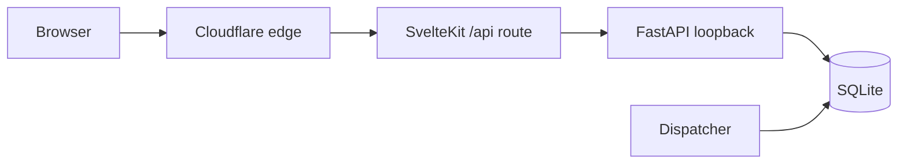
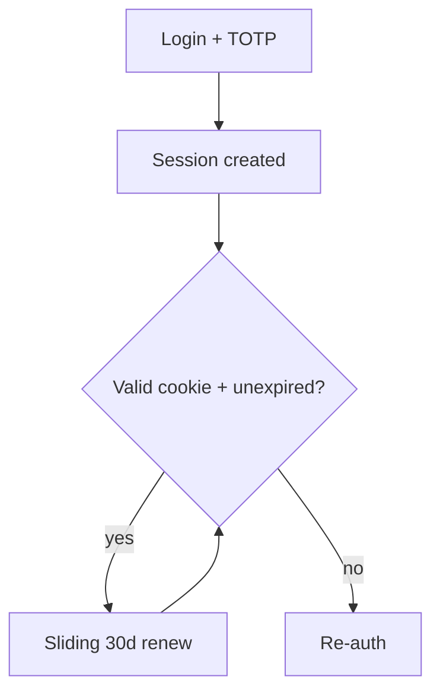
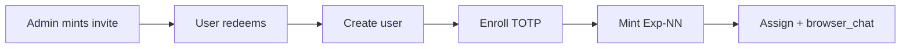

# dos-arch Auth & Provisioning

## Status

> [!class1]
> Living specification. 2026-05-30. **Auth spine + login + hardening pass
> implemented** (sessions, broker-IdP login, password + TOTP, admin user
> management). **Data isolation: flags layer implemented** — the three-class
> model is live on the `flags` surface (project spine + `project_events` +
> visibility enforcement); the **user-private surfaces and the dispatcher are
> the remaining build** (tracked on CC-108).

> [!class3]
> **Implementation progress — data isolation (CC-108, 2026-05-30).**
> - ✅ **Project spine** — `flags` gained `project_id` / `created_by_user_id` /
>   `team_flag`; seeded the System project (user 1 = owner) + a default flag
>   (migration 062, #170). `shell_id` demoted to provenance.
> - ✅ **`project_events`** — append-only, event-only audit log; flags are its
>   first writer (every mutation logs in-transaction) (migration 063, #171).
> - ✅ **Flags visibility enforcement** — one predicate (project membership AND
>   (`team_flag=1` OR creator)) on all reads; mutations gate via a visible-row
>   lookup (404, not 403); create requires + asserts membership; unauthenticated
>   = closed by default (#172). Verified by a synthetic two-tenant predicate test.
> - ⏳ **`project_id` NOT NULL** — enforced at the app layer (422); the physical
>   column constraint is a deferred table-rebuild migration.
> - ⏳ **CI isolation suite** — the spec's executable acceptance gate; **no
>   pytest harness exists in the repo yet**, so this is its own setup task.
> - ⏳ **User-private surfaces** (chats / archives / seed+L&S / decisions /
>   current_state / API keys) + **dispatcher** tenant scoping — not started.
> - ⏳ **`parent_flag_id`** cross-tenant scoping in `_validate_parent` (low
>   severity — leaks existence only, not content).

> [!class3]
> **Implementation notes — hardening pass (2026-05-30).** Four decisions below
> were refined when built; this block is authoritative where it differs from the
> prose:
> - **CSRF**: shipped as **SameSite=Lax + a server-side Origin/Referer allowlist
>   on mutating methods** (`APP_ALLOWED_ORIGINS`), not the double-submit token.
>   Only proxied (browser-surface) mutations are checked; api-key/dispatcher
>   callers are exempt.
> - **Trust boundary**: an absent/invalid internal secret resolves a request to
>   **unauthenticated / no-admin** (not a literal 401-before-anything). `/health`
>   and the dispatcher's tokenless reads keep working; admin is never a default.
> - **UA fingerprint**: **audit-only signal** — a coarse `family|OS|major`
>   fingerprint mismatch logs an `auth_events` anomaly (throttled) but never
>   forces re-auth. Tolerant of minor/patch bumps by construction.
> - **Login rate-limit**: per-email **exponential backoff** (3s, ×2 per failed
>   attempt in a rolling 1h window, capped at 15 min), derived from `auth_events`;
>   blocked polls are logged uncounted so they can't extend the cooldown.

Peer to `docs/specs/agnostic-runtime.md` (browser-chat + runtime) and
`docs/specs/isolation-model.md` (shell *execution* isolation — distinct from
the per-user *data* isolation covered here). This spec covers the user-auth
spine, sessions, login (password + TOTP), tenant data isolation, and
invite-only provisioning. The full shell-type / template-sync model is deferred
to its own spec.

## Overview

dos-arch is now **browser-only and multi-tenant**: one deployment serves
many distinct users over the web, and the CLI launcher path is already gone
(`run.py` and per-shell containers were removed in the API-system cutover —
CC-095/096). There is currently **nothing authenticating anyone** — the HTTP
surface hardcodes `request.state.user_id = 1` for every request.

This spec covers three layers, built in order: the **auth spine** (sessions +
login), **data isolation** (every query user-scoped), and **provisioning**
(invite-only, auto-minted assistant shell). The full shell-type / template-sync
model is deferred to its own spec.

**Audience: trusted / test users only — not a public app.** That posture is why
there is **no email infrastructure**: invites are handed over out-of-band, and
account recovery (password or TOTP) is **admin-driven**, with operator/root
access as the ultimate backstop.

> [!class4]
> The hard part is not the login page. It is data isolation: every router
> assumes `user_id=1`. Multi-tenant means auditing every query against the
> three visibility classes — so no user can read another's **private** surfaces
> (chats, memory, seed/L&S, decisions) or another project's team data, while
> the data that *is* meant to be shared (a project's contacts, mail, flags)
> stays visible to its team.

> [!class1]
> Core invariant, true at every layer below: **the server derives `user_id`
> from the session. The client never supplies it.** Today's hardcoded `1` is
> replaced by a value resolved at the trusted boundary — never by request body
> or header the browser controls.

```stats
:::class1
value: 30d
label: Session lifetime
description: Sliding — renews on activity
:::class2
value: Cookie
label: Session binding
description: Browser cookie — network changes OK
:::class3
value: TOTP
label: Second factor
description: Password + TOTP; admin reset, no email
:::class4
value: 1
label: User scope today
description: Hardcoded user_id=1 — to replace
```

## Goals

### In scope

- Real user authentication on the web surface (password + TOTP MFA).
- Server-side sessions, browser-bound (cookie), sliding 30-day. **No network
  binding** — network changes (incl. VPN) are accepted.
- Per-user data isolation across all routers and the dispatcher.
- Invite-only account provisioning (no open signup; invites conveyed
  out-of-band).
- Auto-provision an assistant shell (`Exp-NN`) at account creation.
- Admin-driven account recovery (password + TOTP reset), operator/root as
  backstop.
- A `shell_type` column with a starting enum (`system`, `assistant`,
  `planner`).

### Non-goals (for this spec)

- Open / self-serve signup.
- **Email infrastructure of any kind** — no transactional sender, no email
  recovery links, no emailed invites. Trusted/test-user scale makes out-of-band
  + admin recovery sufficient.
- Self-service password/TOTP recovery (it's admin-driven).
- Forge-style "log in shell-less, bootstrap your first shell" flow — retired;
  account creation *is* shell creation.
- Org/team accounts, role hierarchies beyond user vs admin.
- SSO / OAuth social login.
- **The full shell-type / template-sync model** — deferred to a separate spec
  (different scope). This spec keeps only what provisioning needs.

## Architecture

Cloudflare fronts the deployment. The browser reaches SvelteKit through CF;
SvelteKit proxies `/api/*` to FastAPI, which binds **loopback only**
(`127.0.0.1:8001`). The browser never touches FastAPI directly.



- **FastAPI owns session resolution.** It hashes the forwarded cookie, looks
  up the session row, checks expiry, and resolves `user_id` — one place, next
  to the data it gates. The hardcoded `user_id = 1` is deleted.
- **The SvelteKit `/api/[...path]` route is the trust seam.** A real server
  route (not the Vite dev proxy) that forwards each request to FastAPI with:
  the session cookie, a shared **internal secret** proving it is the proxy,
  and Cloudflare's `CF-Connecting-IP`.
- **`hooks.server.ts`** does a lightweight `/me` check only for page-redirect
  UX (no session → `/login`). It does not own auth logic.
- **Cloudflare fronts the edge** — TLS, WAF, and `CF-Connecting-IP` (the true
  client IP, used for audit logging, not session binding).

> [!class1]
> Core invariant: FastAPI trusts the **internal secret**, not the browser. A
> request without it is rejected (401) before anything else, and any
> client-supplied copy of the internal secret, `user_id`, `CF-Connecting-IP`,
> or `X-Forwarded-For` is ignored — only what the SvelteKit route sets counts.

> [!class2]
> Two auth layers stay **separate**. *User auth* (new — who is the human) vs
> *shell `api_key_hash` auth* (exists — which shell is calling the API). A
> shell's key authorizes the shell; user identity is its own thing. Tenant
> isolation must hold across both.

## Sessions

Server-side sessions, **not JWT**: a `sessions` table + an httpOnly / Secure /
SameSite cookie. Rationale — matches the stack (SQLite + scrypt already
present), instantly **revocable** (delete the row = logged out everywhere),
and avoids refresh-token machinery for zero benefit since we hit the DB per
request regardless.

### Binding & lifetime



| Property | Value | Notes |
|---|---|---|
| Network bind | **None** | Network changes (incl. VPN) accepted. The hardened surface (CF + internal secret + httpOnly token + MFA) carries the weight instead of IP/ASN pinning. |
| Browser bind | Cookie (httpOnly) + UA fingerprint | The cookie is the primary bind. A **UA fingerprint** (browser family + OS + major version) is a second bind: a *material* change → re-auth; minor version bumps are tolerated so routine browser auto-updates don't log you out. |
| Lifetime | **Sliding 30 days** | Each authenticated request renews `expires_at`. A stable browser stays logged in effectively indefinitely; only 30 days of inactivity (or explicit logout / revoke) ends it. |
| Revocation | Delete session row | Instant, global for that session. |

> [!class4]
> Network binding was dropped deliberately: the surface is hardened enough
> (Cloudflare edge + internal-secret seam + httpOnly hashed token + password +
> TOTP) that IP/ASN pinning adds friction (VPN use, roaming) without
> proportionate gain. Cookie theft is mitigated by httpOnly + Secure + the
> short-lived nature of practical exfiltration windows, not by IP pinning.

## Login & MFA

**Password (existing scrypt) + TOTP = standard MFA.** No email factor and no
email recovery — recovery is admin-driven (see *Enrollment & recovery*).

```linear
Username :::class1 -> Password :::class2 -> TOTP code :::class2 -> Session :::class3
```

### Why TOTP for the second factor

- **Free and self-contained.** TOTP is an open standard (RFC 6238) — `pyotp` +
  a QR at enrollment, no service, no per-use cost, no outbound infra. This is
  what lets us drop email entirely.
- **Login is rare.** Sliding-30d sessions mean a stable user logs in ~once a
  month, so one-time TOTP enrollment friction is amortized to near-zero.
- **No email dependency.** Day-to-day login needs nothing but the password and
  the authenticator app on the user's device.

### Enrollment & recovery

- Enroll at account setup: scan QR → confirm one code → `totp_secret` stored
  (encrypted at rest).
- **Recovery is admin-driven** — no self-service, no email. A locked-out user
  asks the admin, who clears `totp_secret` and/or the password so the user
  re-enrolls / resets on next login. **Operator/root** (direct DB access) is
  the ultimate backstop. Justified by trusted/test-user scale with an always-
  reachable admin.

## Data isolation

Isolation is **not** uniform per-user scoping. The core data model
(`docs/core-data-model.md`) makes the **project** the spine, so most data is
*shared within a project team* — teammates are meant to see each other's work.
Visibility splits into **three classes**; the only genuinely private surfaces
are a user's own shell-mind and a per-flag privacy bit. This is still the bulk
of the work and where a real leak would happen.

### Three visibility classes

| Class | Surfaces | Rule |
|---|---|---|
| **Project-team** | contacts, emails, events, notes; flags; `project_events`; shell **profile card** (`display_name`, `shortname`, `role`, `mandate`, `shell_type`) | visible to **members** of the relevant project (`user_projects`) |
| **User-private** | `chat_sessions` / `chat_messages`, `shell_memory_archives`, `shell_identity_entries` (seed + L&S), `shell_decisions`, `current_state`, API keys | **owner + that shell only** — never team-visible, even between teammates |
| **Global** | the projects catalogue (discovery; join is self-service); `is_shared=1` system shells | every authenticated user |

> [!class1]
> The system's **only** isolation predicate beyond plain project membership is
> the per-flag privacy bit. Everything project-scoped reduces to one membership
> check; everything user-private reduces to ownership.

### Domain data — project-membership-scoped, compartmentalized

contacts / emails / events / notes are visible iff you are a member of a
project the item is filed under:

```sql
project_id IN (SELECT project_id FROM user_projects
               WHERE user_id = :me AND is_deleted = 0)
```

Contacts and events are N:M to projects (visible via *any* shared project);
emails file under one project; notes derive from their target's projects.
**Compartmentalized by design:** because a contact is N:M but each email files
under one specific project, the contact *card* can be broader than its
*correspondence* — you can see *who* a contact is without seeing *every*
conversation about them. A deliberate security layer, not an accident.

### Flags — project-scoped + a private bit

Flags gain `project_id` (required), `created_by_user_id`, and `team_flag`
(default `1`). Visibility:

```sql
project_id IN (my joined projects)
  AND (team_flag = 1 OR created_by_user_id = :me)
```

`team_flag = 1` → the whole project team sees it **and any member may act on
it** (resolve / edit / note); `team_flag = 0` → creator-only (the "private
flag" right). `shell_id` is demoted to provenance ("which shell raised it") —
no longer an access axis.

### Logging — `project_events`, event-only

Every flag action (and later, other project actions — tbd) writes an
append-only `project_events` row: `project_id`, `entity_type` / `entity_id`,
`action` (`created` / `updated` / `resolved` / `reopened` / `deleted`), the
actor (`actor_user_id` and/or `actor_shell_id`), `created_at`. **It logs the
event, never the data** — no field values, no note bodies — so it is uniformly
team-visible with no per-entity filtering (a private flag's "updated by X"
leaks nothing). Written app-layer in the **same transaction** as the action,
not via triggers — a trigger can neither see the session actor nor name the
semantic action.

### The dispatcher

It bypasses HTTP, so it gets no request dependency for free. It must resolve
the **message-owner's** `user_id` and apply the same predicates — domain reads
through the owner's `user_projects`, writes never outside the owner's tenant.

> [!class1]
> Acceptance test for isolation: authenticated as user A, no API path,
> dispatcher action, or crafted request can read or mutate any row outside A's
> visibility — where A's visibility = {A's private rows} ∪ {shared shells} ∪
> {project-team rows for projects A has joined, minus other users' private
> flags}. The CI suite asserts this against B's IDs (404 / empty).

> [!class3]
> **Parked for a dedicated pass:** the `notes` table in its entirety (kinds,
> the `resolution_notes` overlap), and the `notes.user_id` arc — a note *about*
> a user has no project to derive visibility from, and resolves with that
> review.

## Shell types

> [!class4]
> **Scope note:** the full shell-type / template-sync *model* is **deferred to
> a separate spec** — it is broader than auth. What this auth spec commits to
> is only: the `shell_type` column + starting enum, and the decisions banked
> below (so provisioning has something concrete to mint).

A `shell_type` column on `shells`. Starting enum: **`system`**, **`assistant`**
(Exp-Prime and its clones), **`planner`**. Extensible.

A **type is a template**: a synced bundle of `system_prompt` + skill set +
tool set. A shell instance = `template (synced) + identity (its own) + owner +
number`. The mechanics of that sync are the deferred work; the shape is below.

### Sync = single source of truth, by reference

Grant skills/tools (and resolve the prompt) at the **type** level, not the
shell. Effective set for a shell:

```
template facets  =  the assistant type's bundle   (prompt + skills + tools)
identity facets  =  the shell's own rows           (seed/L&S/decisions/state)
effective skills =  type grants  ∪  per-shell extras (if ever needed)
```

There is nothing to "sync" because there is one source. Edit the type →
every `Exp-NN` reflects it on next boot. No copy, no propagation job, no
drift. (Same principle as the memory DB: one source of truth, pointers
elsewhere.)

### What a clone inherits vs blanks

| Facet | Source | On clone |
|---|---|---|
| Skills / tools | assistant type (by reference) | resolved live — nothing copied |
| `system_prompt` (base behavior) | assistant type (synced) | resolved live |
| Role / mandate | type template | inherited |
| seed / L&S / decisions / archives / current_state | the shell's own | **blank** |
| `user_id`, `Exp-NN` name, `browser_chat=1` | per instance | set at creation |

### Exp-Prime: canonical template + beta tester

Exp-Prime is a **live, used** shell *and* the reference definition of the
assistant type. "As we use him, we improve him, he improves the others" — so
improvements to Prime's **template facets** (prompt / skills / tools)
propagate to the fleet. Prime's **identity facets** (its own seed, L&S,
memories) never propagate — clones stay blank-identity.

> [!class3]
> **Decided: live propagation (no promote step).** Clones read Prime's template
> facets live — edit Prime, the fleet reflects it on next boot. Accepted
> tradeoff: an in-progress edit on Prime (the beta surface) goes live to users,
> which is acceptable at invite-only scale with a single operator curating
> Prime. A promote/publish gate can be added later if the fleet grows.

## Provisioning

**Invite-only.** Admin mints an invite; redeeming it creates the user and
auto-mints their assistant shell in one transaction. There is no empty state
and no user-facing Forge bootstrap.



- **Invite**: single-use, expiring token, conveyed to the user **out-of-band**
  (no email send); records who minted it and who redeemed it. Redeeming lets
  the user set their own password and enroll TOTP.
- **Mint `Exp-NN`**: `shell_type='assistant'`, `user_id=<new user>`,
  `display_name='Exp-NN'` where `NN = max(NN)+1` over assistant shells inside
  the creation transaction (fine at invite-only volume), `browser_chat=1`.
  Clones Exp-Prime's current base (prompt / skills / tools); identity facets
  (seed / L&S / memory) start blank. (Live sync of that base arrives with the
  deferred shell-type model.)

## Mechanics: crypto & storage

How each secret is generated, stored, and verified. The throughline: **a DB
leak should expose nothing directly usable.**

### Passwords (scrypt)

- Verify in constant time; never branch around the comparison.
- Rehash-on-login: if stored params are below the current target, transparently
  re-hash after a successful verify. Raises cost over time, no migration.
- Uniform failure message; never distinguish "no such user" from "bad password".

### Session tokens — hash at rest

- Generate with a CSPRNG, ≥256 bits, base64url.
- Store only `SHA-256(token)` in `sessions` — never the raw token. SHA-256
  (not scrypt) is correct *because* the token is high-entropy: no salt, no slow
  hash. A DB leak yields hashes, not usable cookies.
- Lookup = hash the incoming cookie, index lookup by hash.
- Regenerate the token after **both** factors pass — never elevate a pre-auth
  session (session-fixation defense).

### TOTP — encrypt, don't hash

- The secret is symmetric: verification needs the plaintext seed, so **encrypt
  at rest** with a key held outside the DB (the broker — see Secrets). Do not
  hash it.
- Verify with ±1 time step for clock skew.
- **Replay guard:** store the last consumed time-step per user; reject reuse
  within the window (a sniffed code is otherwise replayable ~90s).
- **Rate-limit:** the code space is 10⁶ over a ~3-step window — brute-forceable
  without throttling. Cap attempts per window, then backoff/lockout. Mandatory.
- Enrollment: `otpauth://` URI → QR; require one correct code to activate.
- Lost device: **admin reset** clears `totp_secret` for re-enrollment — no
  recovery codes, operator/root as ultimate backstop.

### Secrets

- The **internal proxy secret** and the **TOTP encryption key** come from the
  broker / env — never the DB, never code. Rotatable.

## Mechanics: trust seam & edge

### Proving the caller is the proxy

- Loopback bind is necessary but not sufficient — anything on the host can
  reach `127.0.0.1:8001`. Require a shared **internal secret**
  (`X-Internal-Auth`) on every request; absent/wrong → 401 before any other
  handling. Only the SvelteKit route holds it.

### Client IP via Cloudflare (audit only)

- CF sets `CF-Connecting-IP` (true client IP). FastAPI records it in
  `auth_events` for audit/abuse signal — **not** for session binding (network
  binding was dropped).
- **Forwarded-header discipline:** trust this header **only** when the internal
  secret is present (i.e. from the proxy hop). Ignore any client-supplied
  `CF-Connecting-IP` / `X-Forwarded-For` / `X-Internal-Auth` / `user_id`.
  uvicorn `--forwarded-allow-ips` scoped to the proxy.

### CSRF — SameSite=Lax + token on mutations

- Session cookie is `SameSite=Lax` (keeps deep-link UX), so cross-site POSTs
  are blocked but a token is still owed on state-changing requests.
- Use a **double-submit token**: a non-httpOnly CSRF cookie + a matching
  `X-CSRF-Token` header the SvelteKit client echoes on POST/PUT/DELETE.
  FastAPI rejects mutations where header ≠ cookie.
- GET/read endpoints need no token and must stay side-effect-free.

### Cookie attributes

`__Host-dsess=<token>; HttpOnly; Secure; SameSite=Lax; Path=/; Max-Age=2592000`

- `__Host-` prefix forces Secure + Path=/ + no Domain.
- `HttpOnly` (no JS access) + `Secure` (HTTPS only, enforced by CF + HSTS).

## Mechanics: isolation & lifecycle

### Tenant isolation — structural, not disciplinary

- Resolve `user_id` once per request (a FastAPI dependency); all data access
  goes through **tenant-scoped accessors** that inject the filter. No raw
  unscoped queries in routers.
- **Ownership assert** after any fetch-by-id: `row.user_id == request.user_id`
  before returning — defense in depth against a missed filter.
- Return **404, not 403**, for "not yours" — 403 confirms existence.
- **Isolation test suite** (CI): authenticated as A, hit every endpoint against
  B's IDs, assert 404/empty. The spec's acceptance gate, made executable.

### Sliding expiry — throttle the write

- Renewing `expires_at` every request = a DB write per request. Instead renew
  only when past ~1/24 of the lifetime since `last_seen` (~every 30 min for a
  30-day window). Same effect, negligible writes.

### Revocation & cleanup

- Delete the row = instant revoke. Password change or TOTP reset → delete all
  the user's sessions. "Log out everywhere" = the same operation.
- Periodic job prunes expired/revoked rows.

### Admin recovery (no email)

- An admin endpoint clears a locked-out user's `totp_secret` (forcing
  re-enrollment) and/or sets a one-time password, then deletes that user's
  sessions. The user re-enrolls / resets on next login.
- **Operator/root** (direct DB access) is the ultimate backstop — there is no
  self-service path by design. Every reset writes an `auth_events` row.

### Invites — atomic redemption

- Redeem is one transaction: `UPDATE invites SET redeemed_at=… WHERE
  token_hash=? AND redeemed_at IS NULL` (rowcount guards the double-redeem
  race), then create user, then mint `Exp-NN`.

### The dispatcher

- It bypasses HTTP, so it gets no request dependency for free. It must use the
  same tenant-scoped accessors and scope every action to the message's owning
  user.

## Schema changes

New / changed objects (SQLite, `.sql` migrations — dos-arch convention):

| Object | Purpose |
|---|---|
| `sessions` | `session_id` (hashed token), `user_id`, `ua_hash` (stable UA components), `created_at`, `last_seen_at`, `expires_at`, `revoked`. No IP/ASN column. |
| `invites` | `token` (hashed), `created_by`, `created_at`, `expires_at`, `redeemed_at`, `redeemed_by_user_id`, single-use. |
| `users.totp_secret` + `totp_enrolled_at` | TOTP enrollment (secret encrypted at rest). |
| `shells.shell_type` | enum: `system`, `assistant`, `planner` (extensible). |
| `auth_events` | append-only audit log: login ok/fail, TOTP fail, session create/revoke, invite redeem, admin reset, admin actions. Includes `CF-Connecting-IP`. Secrets never logged. |
| `flags` (modify) | + `project_id` (required), `created_by_user_id`, `team_flag` (default 1; 0 = creator-only). `shell_id` demoted to provenance. |
| `project_events` | append-only, project-scoped event log: `entity_type` / `entity_id`, `action`, `actor_user_id` / `actor_shell_id`, `created_at`. **Event-only — no data/detail column.** Flags are the first writer; other project actions wire in later. |

> [!class4]
> `shell_types` / `type_skills` / `type_tools` (the template-sync tables) are
> **deferred** with the shell-type model — not part of this spec's migrations.

> [!class3]
> Already present, reusable: `users.password_hash` / `password_salt` (scrypt),
> `create_user.py` / `set_password.py`, `shells.api_key_hash` (shell auth).
> The password-verification half of login is built — what's missing is
> everything between "password correct" and "this request is user N."

## Build order

```linear
Auth spine :::class1 -> Isolation :::class2 -> Provisioning :::class3
```

1. **Auth spine** — `sessions` table, cookie, `hooks.server.ts`, prod
   `/api/[...path]` route + internal secret, FastAPI session resolution
   (delete hardcoded `user_id=1`). Password + TOTP login + `/login` route +
   CSRF tokens.
2. **Isolation** — scope every router + the dispatcher by the three-class
   model: user-private surfaces by `user_id`, project-team surfaces by
   `user_projects` membership, flags by membership + `team_flag`. Add the
   `flags` columns + `project_events` table; tenant accessors + ownership
   asserts; verify the CI acceptance suite. Highest-risk layer.
   *(Progress — see Status: ✅ flags layer (`flags` columns + `project_events`
   + visibility enforcement, #170–#172); ⏳ user-private surfaces, dispatcher
   scoping, physical `project_id` NOT NULL, and the CI suite remain.)*
3. **Provisioning + admin** — `invites` table + admin mint endpoint; redeem →
   create user → enroll TOTP → mint `Exp-NN` (`shell_type='assistant'`)
   transaction. Plus the admin recovery endpoint (TOTP/password reset).

> [!class4]
> The full **shell-type / template-sync model** (`shell_types`, type grants,
> live resolution at boot) is a **separate, deferred spec**. Provisioning here
> only needs to stamp `shell_type='assistant'` and clone Exp-Prime's current
> base; live sync lands with that later work.

## Open questions

- [ ] **Shell-type / template-sync model** — deferred to its own spec; track
      separately. Planner type behavior still to be defined there.

Resolved: network binding **dropped** (network changes accepted); login factor
= **password + TOTP**; template propagation = **live**; shell-type enum =
**system / assistant / planner** (model deferred); UA fingerprint = **a real
bind on stable components** (tolerate minor version bumps); **email scrapped**
entirely — recovery is **admin-driven** with operator/root as backstop;
invites conveyed **out-of-band**. Audience = **trusted / test users only**.

With email gone, the auth surface has **no paid or third-party dependency** —
password + TOTP + sessions + CSRF are all $0, in-process, self-hosted.

## Decisions locked

| Decision | Choice |
|---|---|
| Tenancy | Multi-tenant, one deployment, full per-user isolation |
| Access path | Browser-only (CLI already removed) |
| Auth boundary | SvelteKit BFF; FastAPI loopback trusts injected user |
| Session mechanism | Server-side sessions + httpOnly cookie |
| Network binding | **None** — network changes accepted (VPN-friendly) |
| Browser binding | Cookie (httpOnly; `__Host-` prefix under TLS) + UA fingerprint **audit-only** (logged, not enforced) |
| Lifetime | Sliding 30 days |
| Login factor | Password + TOTP MFA |
| Email | **None** — scrapped; no email infra |
| Account recovery | Admin-driven (password + TOTP reset); operator/root backstop |
| Audience | Trusted / test users only (not public) |
| Provisioning | Invite-only; invites conveyed out-of-band |
| First shell | Auto-mint `Exp-NN` assistant at account creation |
| Empty-state / Forge bootstrap | Retired |
| Shell-type enum | `system` / `assistant` / `planner` (full model deferred) |
| Template propagation | Live-by-reference (no promote step) |
| Skills/tools/prompt | Synced per shell-type (deferred model) |
| Exp-Prime | Canonical template + beta tester; live propagation |
| Edge | Cloudflare: TLS + WAF + client IP (audit only) |
| Session resolution | FastAPI (loopback), behind an internal-secret seam; no secret → unauthenticated/no-admin (not a hard 401) |
| `/api` proxy | SvelteKit `/api/[...path]` server route (the trust seam) |
| CSRF | SameSite=Lax + **server-side Origin/Referer allowlist** on proxied mutations (`APP_ALLOWED_ORIGINS`) |
| Login rate-limit | Per-email exponential backoff (3s ×2/fail, 1h window, 15-min cap), `auth_events`-derived |
| Session token | SHA-256 hashed at rest |
| TOTP secret | Encrypted at rest, broker-held key |
