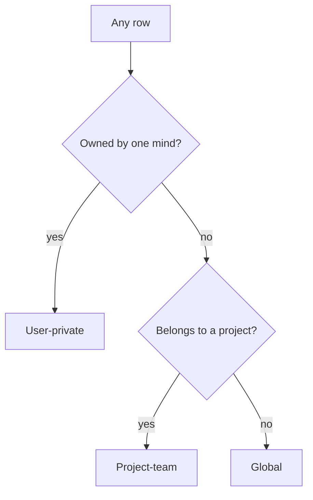
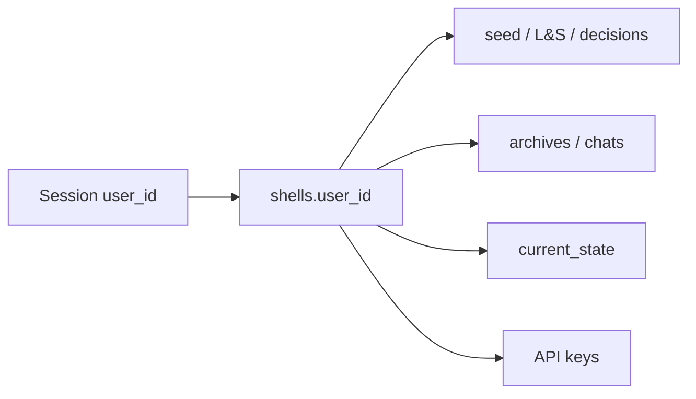
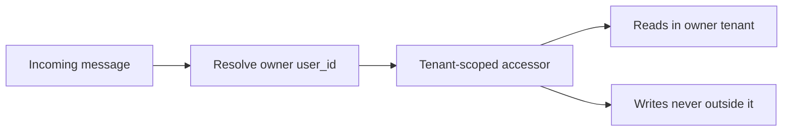

# dos-arch Data Isolation

## Overview

This spec defines **what every row in dos-arch is visible to, and where that
rule is enforced** — surface by surface, with an executable acceptance gate.
It promotes the *Data isolation* section of `auth-provisioning.md` to a
first-class spec, because it is the largest and highest-risk remaining build
(CC-108): a single missed predicate is a cross-tenant leak.

The auth spec answers *who is the caller* (sessions, login, the internal-secret
seam). This spec assumes that is solved and answers the next question: **given a
resolved `user_id`, which rows may this request read or mutate, and how is that
guaranteed structurally rather than by discipline.**

> [!class1]
> Core invariant — true at every layer below: **the server derives `user_id`
> from the session; the client never supplies it.** Isolation is then a pure
> function of that trusted `user_id` and the row's class. No request body,
> header, or shell key can widen it.

Isolation here is **not** uniform per-user scoping. The core data model
(`core-data-model.md`) makes the **project** the spine, so most data is *shared
within a project team* by design. The job is to split every surface into the
right visibility class and enforce its predicate at every door — HTTP routers
**and** the off-HTTP dispatcher.

```stats
:::class1
value: 3
label: Visibility classes
description: Project-team · user-private · global
:::class3
value: 1
label: Layers built
description: flags (the reference pattern)
:::class4
value: 2
label: Predicates total
description: Project membership + per-flag privacy bit
:::class2
value: 404
label: Denial code
description: Never 403 — that confirms existence
```

## Status

> [!class1]
> Living specification. 2026-05-31. **Flags + user-private surfaces built, and
> the CI acceptance harness now exists** (`tests/`, 21 passing). Remaining: the
> dispatcher's domain reads and per-surface CI coverage for the domain routers
> as they land. Tracked on CC-108. Source of truth for *who is the caller* is
> `auth-provisioning.md`; this spec owns *what they may see*.

```linear
Flags :::class3 -> User-private :::class3 -> CI harness :::class3 -> NOT NULL :::class3 -> Domain :::class1
```

- ✅ **Project spine** — `flags` gained `project_id` / `created_by_user_id` /
  `team_flag`; System project seeded (migration 062, #170). `shell_id` demoted
  to provenance.
- ✅ **`project_events`** — append-only, event-only audit log; flags are its
  first writer, logging in-transaction (migration 063, #171).
- ✅ **Flags visibility** — one predicate on all reads; mutations gate via a
  visible-row lookup (404, not 403); create asserts membership; unauthenticated
  = closed by default (#172). Verified by a two-tenant predicate test.
- ✅ **User-private surfaces** — seed+L&S / decisions / archives / chat +
  sessions / `current_state` are owner-gated via one primitive
  (`auth._require_shell_owner` / `_shell_access`, 404-not-403); `get_shell`
  returns the card to any visible caller but nulls the private columns for
  non-owners; the broker-keys surface (`keys.py`) is now admin-only (was
  ungated). Verified live: shell-self 200, cross-shell + unauthenticated 404,
  dispatcher turn unbroken (PR pending).
- ⏳ **Dispatcher domain reads** — the off-HTTP path already acts via each
  shell's own key (so shell-private calls are gated), but its *domain* reads
  (contacts/emails/events) must resolve the message-owner's `user_id` once those
  routers exist. Tracked with step 4.
- ✅ **CI isolation harness** — stood up at `tests/` (pytest; `pytest.ini`
  `pythonpath=shell_core`). `conftest.py` builds a throwaway DB from `schema.sql`
  + post-059 migrations and seeds **two tenants** (Alice/Bob) + a shared shell;
  `test_isolation.py` asserts cross-tenant 404 / owner-200 across the
  user-private surfaces, shared-card private-column nulling, the broker-keys
  admin gate, and the flags membership layer. **21 passing.** Domain-router
  coverage extends it as those routers land.
- ✅ **`project_id NOT NULL`** — physical constraint landed (migration 064,
  table rebuild; drops/recreates the `flag_schedule` view around it). A flag can
  no longer be project-less at the DB level, not just at the 422. Asserted in CI.

## Three classes

Every surface in the system reduces to exactly one of three classes. The whole
spec is the discipline of *assigning each table to the right class and never
mixing them up*.



| Class | Rule | Reduces to |
|---|---|---|
| **Project-team** | visible to **members** of the row's project (`user_projects`) | one membership check |
| **User-private** | **owner only** — never team-visible, even between teammates | one ownership check |
| **Global** | every authenticated user | a session, nothing more |

> [!class1]
> The system's **only** isolation predicate beyond plain project membership is
> the per-flag privacy bit. Everything project-scoped reduces to one membership
> check; everything user-private reduces to ownership; everything global needs
> only a valid session. Three rules, no per-entity special cases.

### The two canonical predicates

```sql
-- Project-team: the row's project is one I have joined
project_id IN (SELECT project_id FROM user_projects
               WHERE user_id = :me AND is_deleted = 0)

-- User-private: the row's owning user is me
-- (surfaces key on shell_id; shell_id -> shells.user_id is the owner)
shells.user_id = :me
```

Global needs no predicate — only that `:me` resolved to a real session.

## Surface matrix

The heart of the spec: **every table, its class, its predicate, where the
predicate is enforced, and its build status.** A surface absent from this table
is a surface nobody has classified — which is itself a finding.

| Surface | Class | Predicate / rule | Enforced at | Status |
|---|---|---|---|---|
| `flags` | project-team + bit | membership AND (`team_flag=1` OR creator) | `flags.py` | ✅ |
| `project_events` | project-team | membership; event-only, no detail col | `flags.py` writer | ✅ |
| `contacts` | project-team | visible via **any** shared project (N:M) | router TBD | ⏳ |
| `contact_projects` | project-team | derived from `contacts` | router TBD | ⏳ |
| `emails` | project-team | files under **one** `project_id` | router TBD | ⏳ |
| `events` | project-team | via `event_projects` (N:M) | router TBD | ⏳ |
| `event_contacts/users/projects` | project-team | derived from `events` | router TBD | ⏳ |
| `notes` | project-team* | derive from target's project (*user-target parked) | router TBD | ⏳ |
| shell **profile card** | project-team / global | `display_name`/`shortname`/`role`/`mandate`/`shell_type` | `shells.py` | ⏳ |
| `chat_sessions`/`chat_messages` | user-private | `_require_shell_owner` | `shells.py` | ✅ |
| `shell_memory_archives` | user-private | owner (by shell or archive_id) | `shells.py` | ✅ |
| `shell_identity_entries` (seed/L&S) | user-private | `_require_shell_owner` | `shells.py` | ✅ |
| `shell_decisions` | user-private | `_require_shell_owner` | `shells.py` | ✅ |
| `shells.current_state` | user-private | owner; nulled for non-owner on card GET | `shells.py` | ✅ |
| broker secrets | admin-only | `_require_admin` | `keys.py` | ✅ |
| `sessions`/`auth_events`/`totp_secret` | user-private | own rows only | `auth.py` | ✅ (auth) |
| `projects` catalogue | global | discovery; self-service join | `catalogue.py` | n/a |
| `is_shared=1` shells | global | every authenticated user | `shells.py` | n/a |
| skills / tools / models | global | reference catalogue, read-all | catalogue routers | n/a |
| admin endpoints | admin-only | `is_admin` gate (orthogonal axis) | `admin.py` | ✅ |

> [!class4]
> **Compartmentalization is deliberate.** A contact is N:M to projects but each
> email files under **one** project — so a contact *card* can be broader than
> its *correspondence*. You may see *who* a contact is without seeing every
> conversation about them. A security layer, not an accident — preserve it when
> wiring the domain routers.

> [!class3]
> **Parked for a dedicated pass:** the `notes` table in full (kinds, the
> `resolution_notes` overlap) and the `notes.user_id` arc — a note *about* a
> user has no project to derive visibility from. Classify it with that review,
> not by guessing here.

## Reference pattern

`flags.py` is the **built, verified reference** — every later surface copies its
shape. Four helpers carry the whole isolation contract:

| Helper | Role |
|---|---|
| `_visibility_sql(request, alias)` | returns the `WHERE` fragment + bind params for the class predicate — composed into **every** read |
| `_visible_row(con, request, id)` | the row **iff** it exists, is live, **and** is visible — collapses 'forbidden' into 'not found' |
| `_log_event(con, request, ...)` | writes the `project_events` row in the **same transaction** as the mutation |
| membership assert on create | a row may only be created inside a project the caller has joined |

```sql
-- the predicate, lifted verbatim from flags.py _visibility_sql:
f.project_id IN (SELECT project_id FROM user_projects
                 WHERE user_id = ? AND is_deleted = 0)
  AND (f.team_flag = 1 OR f.created_by_user_id = ?)
```

> [!class1]
> **Reads compose the predicate; mutations route through `_visible_row` first.**
> An update/delete/resolve does a visible-row lookup and 404s if it returns
> nothing — so 'not yours' and 'does not exist' are indistinguishable to the
> caller. No mutation path skips that gate.

> [!class2]
> **Unauthenticated = closed by default, structurally.** With no resolved
> `user_id` the membership subquery is empty, so the predicate matches zero
> rows. Denial is the *default* output of the same SQL, not a separate branch
> someone has to remember to add.

## User-private

The genuinely private surfaces: a user's own shell-mind. **Owner-only — never
team-visible, even between teammates**, and not visible to another of the same
user's shells unless surfaced through the owning user.



- All user-private surfaces key on `shell_id`; the owner is `shells.user_id`. The
  predicate is therefore always *join through the shell to its owner* —
  `... JOIN shells USING(shell_id) WHERE shells.user_id = :me`.
- **No `team_flag` equivalent.** There is no "share my seed with the team" bit;
  these are categorically private. Sharing a shell's *identity* is out of scope
  by design — only its **profile card** (name / role / mandate / type) is
  project-team-visible, as the public face of the shell.
- **API keys** (`keys.py`) are the sharpest edge: a leaked key authorizes a
  shell. Owner-only read, and the raw key is shown **once** at mint (hash at
  rest — see `auth-provisioning.md`).

> [!class4]
> The boundary that matters most and is **least built**. A missed filter on
> `shell_decisions` or `chat_messages` leaks the substance of another user's
> private work — not metadata. This is the layer to write the acceptance test
> against first.

## The dispatcher

The dispatcher drives browser-chat **off the HTTP path**, so it inherits **none**
of the router's request-scoped protections for free. It is the most likely place
for an isolation bug, precisely because the framework isn't holding the line.



- It must resolve the **message-owner's** `user_id` (the shell's owner), not a
  hardcoded value, and thread it through the **same tenant-scoped accessors** the
  routers use — no second, looser data path.
- Domain reads go through the owner's `user_projects`; writes never land outside
  the owner's tenant.
- It writes `project_events` in-transaction on the same actions, recording
  `actor_shell_id` (and `actor_user_id` where a human is behind it).

> [!class1]
> Single rule for the dispatcher: **there is exactly one set of tenant-scoped
> accessors, and both the routers and the dispatcher go through it.** A query
> the dispatcher issues that a router could not is a bug by construction.

## Logging

`project_events` is the append-only audit spine. It records **the event, never
the data**: `project_id`, `entity_type` / `entity_id`, `action`
(`created` / `updated` / `resolved` / `reopened` / `deleted`), the actor
(`actor_user_id` and/or `actor_shell_id`), `created_at`.

> [!class3]
> Because it carries **no field values or note bodies**, it is uniformly
> team-visible with no per-entity filtering — a private flag's "updated by X"
> leaks nothing about the flag's content. The event-only shape is what lets one
> membership check gate the whole log.

- Written **app-layer, in the same transaction** as the action — not via
  triggers. A trigger can neither see the session actor nor name the semantic
  action (`resolved` vs a bare `UPDATE`).
- Flags are the first and only writer today; other project actions (contacts /
  emails / events / notes) wire in as their routers land.

## Enforcement

Isolation is **structural, not disciplinary** — built so the *default* path is
safe and an unscoped query is the thing you have to go out of your way to write.

| Mechanism | Rule |
|---|---|
| Resolve once | `user_id` resolved a single time per request (a FastAPI dependency); never re-derived downstream |
| Scoped accessors | all data access flows through tenant-scoped accessors that inject the predicate — **no raw unscoped queries in routers** |
| Ownership assert | after any fetch-by-id, assert `row.user_id == request.user_id` before returning — defense in depth against a missed filter |
| 404 not 403 | "not yours" returns 404 — a 403 confirms the row exists |
| One door | routers and dispatcher share the same accessors |

> [!class1]
> Two independent gates on every private read: the **predicate** (you never
> selected the row) and the **ownership assert** (even if a query drifted, the
> return is checked). A leak requires *both* to fail at once.

> [!class4]
> The anti-pattern to hunt for in review: a `SELECT ... WHERE id = ?` with **no**
> tenant predicate, "protected" only by the fact that callers happen to pass
> their own ids today. That is a latent cross-tenant read. Every fetch-by-id
> gets the predicate **and** the assert, or it doesn't ship.

## Acceptance gate

The spec's teeth: an **executable CI suite**, not a prose promise — now stood up
at `tests/` (pytest). `conftest.py` builds a throwaway DB from `schema.sql` +
post-059 migrations and seeds two tenants + a shared shell; `test_isolation.py`
holds the cases below. **21 passing.** Run it with `.venv/bin/python -m pytest`.

> [!class1]
> **The invariant, stated formally.** Authenticated as user A, no API path,
> dispatcher action, or crafted request can read or mutate any row outside A's
> visibility — where
> *A's visibility = {A's private rows} ∪ {shared shells} ∪ {project-team rows
> for projects A has joined, minus other users' private flags}.*

```linear
Seed 2 tenants :::class1 -> Hit A's IDs as B :::class2 -> Assert 404/empty :::class3 -> Mutations too :::class4
```

The suite seeds two tenants (A, B) with overlapping and disjoint projects, then,
authenticated as B:

- **Reads** — hit every endpoint against A's ids → assert `404` or empty set.
- **Mutations** — attempt update / delete / resolve on A's ids → assert `404`,
  and assert A's row is **unchanged**.
- **Private bit** — B is a member of A's project but A's `team_flag=0` flag is
  invisible to B, while A's `team_flag=1` flag **is** visible (and actionable).
- **Dispatcher** — a B-owned shell message cannot read or write A's rows.
- **Unauthenticated** — no session → every scoped read is empty, every mutation
  401/404.

> [!class3]
> Each surface in the matrix is **done** when it has a row in this suite that
> goes red without its predicate and green with it. "Built" = "has a failing
> test that the predicate fixes" — no surface is trusted on inspection alone.

## Build order

```linear
User-private :::class3 -> CI harness :::class3 -> Dispatcher :::class1 -> Domain :::class2 -> NOT NULL :::class4
```

1. ✅ **User-private surfaces** — highest-risk, leaks substance not metadata.
   `shells.py` (identity / decisions / archives / chat / sessions /
   `current_state`) owner-gated by `shells.user_id` via `_require_shell_owner`;
   `keys.py` made admin-only. The `get_shell` card nulls private columns for
   non-owners. Verified live + in CI.
2. ✅ **CI isolation harness** — pytest at `tests/`; two-tenant fixture; red/green
   per built surface (user-private + flags). Domain surfaces extend it as they
   land.
3. **Dispatcher** — route its *domain* reads through the shared tenant accessors;
   resolve the message-owner's `user_id`. (Shell-private calls already gated —
   it carries each shell's own key.)
4. **Domain routers** — contacts / emails / events / notes as they land, each
   project-membership-scoped, preserving compartmentalization. Resolve the
   `notes` parked review here.
5. ✅ **`project_id NOT NULL`** — table-rebuild migration 064 (the lone writer,
   `create_flag`, already stamps a project or 422s). Verified live + in CI.

> [!class4]
> Order is by blast radius, not convenience. User-private first because a miss
> there is worst; the CI suite third because every later surface plugs into it;
> the physical NOT NULL last because it is the cheap formalization of an
> already-enforced rule.

## Open questions

- [ ] **`notes` classification** — the full kind matrix and the `notes.user_id`
      arc (a note *about* a user has no project to derive from). Its own pass.
- [ ] **Cross-user own-shells** — a user owns multiple shells (Exp-NN). Can they
      read across their *own* shells' private minds, or is each shell sealed even
      to its owner's other shells? Default assumption: owner-visible.
- [ ] **`parent_flag_id` cross-tenant** — `_validate_parent` currently leaks a
      parent flag's *existence* (not content) across tenants. Low severity; scope
      a fix.
- [ ] **Shell profile card boundary** — confirm exactly which columns are the
      public card (project-team / global) vs private, so `shells.py` splits the
      row correctly.

Resolved: visibility = **three classes** (project-team / user-private / global);
only extra predicate = **per-flag privacy bit**; denial = **404 not 403**;
logging = **event-only `project_events`**, in-transaction, app-layer; enforcement
= **scoped accessors + ownership assert** (structural, two gates); acceptance =
**executable CI suite**, red-without / green-with per surface.

## References

- `auth-provisioning.md` — the caller-resolution half (sessions, login, the
  internal-secret seam). This spec is its data-plane sibling.
- `core-data-model.md` — the project spine, `user_projects`, and the domain
  tables this spec scopes.
- `isolation-model.md` — shell **execution** isolation (process / FS); distinct
  axis from the per-user **data** isolation here.
- CC-108 — data isolation build (flags layer done; user-private, dispatcher, CI
  suite remaining).
- `flags.py` — the built reference implementation (`_visibility_sql`,
  `_visible_row`, `_log_event`).
