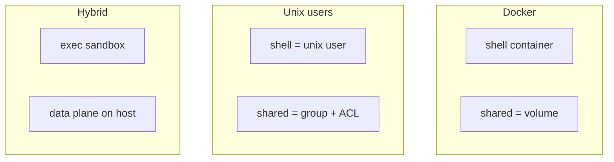
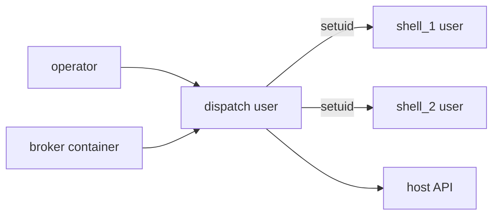

# Shell Isolation — Users vs Containers

## Overview

dos-arch isolates shells so model-driven code in one shell can't read another shell's private data, tamper with the substrate, or roam the host. Today that isolation is done with Docker (rootless), and the cost of Docker is starting to outweigh what it buys. This doc lays out the choice: **keep containers, move to unix users + groups, or run a hybrid** — and recommends a direction.

> [!class1]
> The trigger was CC-095: a WAL SQLite file opened from both a container and the host produced intermittent "database disk image is malformed". Fixing it meant moving the API to the host — which exposed that the container boundary is in the wrong place.

The question is not "is Docker bad." It's: **where does the isolation boundary belong, and is a kernel-namespace boundary worth its operational weight for this substrate's actual shape?**

## What happened

CC-095 forced a close look at the runtime topology. Two findings reframe the whole question.

**The WAL bug was a boundary artifact.** `dos-api` ran as a container with `shell_db.db` bind-mounted; the host dispatcher and modelsync opened the same WAL file directly. Multiple writers across the host/container line gave incoherent `-shm` wal-index reads — transient `SQLITE_CORRUPT` while the on-disk image stayed valid. Moving the API to a host pm2 process put every DB writer in one kernel and the errors stopped.

**The boundary is inverted relative to risk.** What was containerized is the *least* dangerous surface; what runs arbitrary model-driven code has *no* container at all.

| Path | Execution | Isolation today |
|---|---|---|
| Terminal shell (run.py) | per-shell container, `docker exec` | strong (namespaces) |
| Browser shell (dispatcher) | `subprocess` in dispatcher, as host user | none |
| dos-api | structured HTTP/DB | was containerized (now host) |
| dos-broker (secrets) | container | strong — keep |

> [!class4]
> CC-098: the dispatcher's `handle_exec`/`exec_bg` run `subprocess` directly as the host operator (j3d1), no sandbox. A browser shell driven by any model has full host access. The structured API was wrapped; the arbitrary-exec path was not.

## Threat model

Isolation only earns its cost against a real threat. For this substrate the threats, in order:

```stats
:::class4
value: High
label: Shell reads another shell
description: Private memory, keys, FnB data
:::class4
value: High
label: Shell escapes to host
description: Arbitrary exec as operator
:::class2
value: Med
label: Resource exhaustion
description: One shell starves the box
:::class2
value: Low
label: Kernel-level escape
description: Only matters for untrusted tenants
```

What needs wrapping is **tool execution** (bash, fs, git) and **the secrets broker** — not the structured DB/API plane. Any model the substrate drives is semi-trusted at best; the boundary must sit between a shell's tool calls and everything else.

> [!class2]
> Kernel-grade isolation (containers, microVMs) only pays off against *mutually untrusted* tenants. For a handful of trusted FnBs on one box, a weaker-but-simpler boundary is the right trade.

## The three models



| Dimension | Docker | Unix users | Same-user |
|---|---|---|---|
| Shell↔shell FS isolation | Strong | Strong (0700 homes) | None |
| Tool-exec sandbox | Strong | Medium (setuid) | None |
| Shared folders | Volume + uid-map | Group + setgid + ACL | Trivial |
| SQLite WAL across writers | Breaks at boundary | Works (one kernel) | Works |
| Operational weight | High | Medium | Low |
| SaaS / portability | Excellent | Box-specific | Poor |
| Single-operator local | Overkill | Light | Ideal |

The key asymmetry: **the WAL pain and the shared-folder pain are both container-boundary problems.** Unix users on one kernel have neither — WAL is coherent, and cross-user sharing is a solved pattern (next tab).

## Shared folders

This is the crux of the doubt — and it's more solved than it feels. Cross-user shared folders in unix are a standard pattern: **shared group + setgid dir + default ACL.**

```bash
groupadd proj_dosarch
chgrp proj_dosarch /shared/proj_dosarch
chmod 2770 /shared/proj_dosarch          # setgid: new files inherit group
setfacl -d -m g::rwx /shared/proj_dosarch # default ACL: new files group-rwx
```

Set once per project at provision time, scriptable. After that a file written by `shell_3` is transparently usable by `dispatch`, `dosapi`, and the operator.

> [!class3]
> For multi-user sharing this is *less* hassle than Docker volume uid-remapping, not more — which inverts the intuition that pushes toward "same-user Docker for simplicity". Docker is only simpler in the single-user case.

| Approach | Cross-user share | WAL coherence | New file ownership |
|---|---|---|---|
| Docker volumes | uid-map / remap | breaks at boundary | container-uid on host |
| Group + setgid + ACL | inherited group | works | shared group, g-rwx |

## Local vs SaaS

This is the strategic fork, and it resolves the rest. The right isolation model depends on which future dos-arch is built for.

> [!class1]
> **Local / few-trusted-FnBs on one box you maintain** → unix users (or same-user for solo). Docker's portability buys nothing when you maintain one box; you get real isolation, the shared-folder pattern above, and the WAL problem never returns.

> [!class4]
> **SaaS multi-tenant, untrusted users** → lean into containers (or microVMs — gVisor / Firecracker). But design so the DB is never bind-mounted into multiple containers: single API owner, everyone else over HTTP. That kills the WAL problem from the other direction.

```stats
:::class3
value: Local
label: Likely near-term shape
description: Single operator, host-level, no-docker substrate
:::class2
value: SaaS
label: Possible later
description: Would justify containers / microVMs
```

The current pain is the cost of being **halfway**: a containerized API with host-side writers sharing a bind-mounted WAL file — the worst of both. Either clean endpoint avoids it.

## Recommendation

Given dos-arch's stated nature (host-level, single-operator at the API, superCC explicitly no-docker): **hybrid trending to unix users.**



- **Dispatcher = a special-permission user.** It holds the per-shell Bearer keys and talks to the broker, and it spawns tool execution. It `setuid`s into a per-shell unix user before running any tool, so a shell's bash runs as `shell_N` — unable to read another shell's `0700` home or the operator's files.
- **Data plane on the host** (DB, API, dispatch coordinator, modelsync) as host users sharing one kernel — WAL stays coherent.
- **Broker stays containerized** — secrets isolation is the one place a hard boundary clearly earns its keep.
- **Project shared dirs** via the setgid + ACL pattern.

> [!class3]
> This matches where the substrate already is, fixes the WAL class of bug permanently, wraps the real exposure (CC-098), and de-fangs the shared-folder objection. It keeps the SaaS door open: the exec-sandbox seam can later swap unix-setuid for a container/microVM without touching the data plane.

## Migration path

```linear
API to host :::class3 -> Provision users :::class1 -> Dispatch setuid :::class1 -> Shared ACLs :::class2 -> Retire shell containers :::class3
```

1. **API → host pm2** — done (CC-095). WAL multi-writer eliminated.
2. **Per-shell unix users** — provision `shell_<shortname>` at create time (needs root helper); `0700` homes.
3. **Dispatch as privileged user** — runs as its own user; `setuid`/`sudo -u shell_N` wrapper around `handle_exec`/`exec_bg`. Closes CC-098.
4. **Project shared dirs** — group + setgid + default ACL per project; replaces the host↔container `/root/shared` bind-mount.
5. **Retire shell containers** — terminal shells (run.py) run as host unix users; closes CC-097 (no boundary left to cross). Drop `--dangerously-skip-permissions` reliance on the container as sandbox.

> [!class4]
> Steps 2–3 need root at provision time and a small privileged spawn helper. That is the real new complexity this model introduces — weigh it against the container build/compose/networking weight it removes.

## Open questions

- [ ] Root helper: a setuid binary, a `sudo` policy, or a small privileged daemon for user provisioning + shell spawning?
- [ ] Per-shell user lifecycle: created at shell-create, removed at shell-delete? Orphan cleanup?
- [ ] Resource limits without cgroups-via-Docker — `systemd` user slices / `ulimit` / `prlimit`?
- [ ] Does the secrets broker stay a container, or become a locked-down unix user too?
- [ ] SaaS escape hatch: if multi-tenant ever lands, is the exec seam swappable to microVM cleanly?
- [ ] Migration of any existing per-shell containers + their `/root/shared` data.

## References

- CC-095 — DB health / WAL multi-writer (resolved); decision #137 (API → host pm2).
- CC-097 — terminal-shell container reachability (deferred; resolved by step 5).
- CC-098 — dispatcher tool exec unsandboxed (closed by step 3).
- CC-090 — shell / agent / team / project ownership model (multi-user rollout).
- CC-096 — install reconciliation (must follow whichever model is chosen).
